# Modelo de datos — v1

> Schema objetivo de v1, resultado de la revisión de agosto de 2026. Cualquier cambio en una `@Entity` de `backend/` se refleja aquí **en el mismo cambio** (skill `er-diagram-sync`).
>
> El **porqué** de cada cosa está en `decisiones.md`; acá está el **qué**. Las referencias `#n` apuntan a las decisiones cerradas de ese documento.
>
> **Alcance v1**: el schema heredado consolidado, corregido y ampliado con lo que la revisión sacó a la luz. **Campañas y Temporadas quedan fuera a propósito** (`decisiones.md` #7), igual que la integración profunda con Discord.

## 1. Convenciones

| Tema | Convención | Ref. |
|---|---|---|
| Nombre de tabla | `snake_case`, plural, minúsculas | — |
| Nombre de columna | `snake_case` singular. FK = `<entidad_singular>_id` | — |
| Clave primaria | Siempre `id`, `VARCHAR(64)`, UUID v7 generado en la aplicación | #9 |
| Enums | Columna `VARCHAR(32)` + `enum` de Java con `@Enumerated(EnumType.STRING)`. Nunca el tipo `ENUM` de MySQL | #10 |
| Borrado | **Soft delete**: columna `status` con el valor `Deleted` **y** `deleted_at DATETIME NULL` con la fecha. Toda lectura filtra por estado | #25 |
| Cascadas | Se resuelven en el **service layer**, nunca con `ON DELETE CASCADE`. Un borrado arrastra a sus dependientes con la **misma** marca de tiempo, en una transacción | #25 |
| Fechas y horas | **Todo en UTC.** No existe ninguna columna `timezone`: la conversión a hora local la hace el frontend con la zona del navegador | #22 |
| Timestamps | `created_at DATETIME NOT NULL`, `updated_at DATETIME NULL`, `deleted_at DATETIME NULL` donde aplique | #25 |
| Texto enriquecido | `LONGTEXT` en la tabla que lo necesita. **Nunca** una fila de `files`. Se sanitiza al guardar y al servir | #62 |
| Charset | `utf8mb4` / `utf8mb4_unicode_ci` | — |

## 2. Qué cambió respecto al schema heredado

El detalle y el razonamiento están en `decisiones.md`. Resumen de lo estructural:

| Área | Cambio | Ref. |
|---|---|---|
| Nombres | `Tables` → `game_tables`, `Users_registration` → `table_registrations`, `Users_Rejected` → `registration_rejections`, `Days` → `table_schedules`, `Logs` → `audit_logs` | — |
| Zona horaria | **Se eliminan** `users.timezone` y `game_tables.timezone` | #22 |
| Roles | Son **cuatro**: `Player`, `Master`, `Admin`, `Owner`. Acumulables, sin jerarquía | #37, #67 |
| Rol de mesa | `masters.master_type` pasa de `Owner`/`Master` a **`Primary`/`Secondary`** | #71 |
| Postulaciones | **Se quita** el `UNIQUE (game_table_id, user_id)`: un usuario puede postularse N veces | #23 |
| Contador de jugadores | Se elimina `Players_Table`; se deriva con `COUNT`. Se agrega `max_players` | #11, #24 |
| Sesiones | Tabla nueva `table_sessions`, materializada, con asistencia | #33, #36 |
| Peticiones | Tablas nuevas `table_tasks` + `task_submissions` + `submission_files` | #63 |
| Comentarios | **Se elimina `comments.user_created_id`**. El autor vive solo en `comment_drafts` y desaparece al confirmar. Cuota antispam como token opaco | #43, #49, #82 |
| Catálogos | `parent_id` → **`canonical_id`**, profundidad 1. Son grupos de sinónimos, no jerarquía | #53, #59 |
| Archivos | `file_type` (`Public`/`Private`/`Single-use`) y `size_bytes`, que el código usaba y el DDL nunca tuvo. Más `content_hash`, `storage_key` y `last_used_at` | #60, #68, #75, #80 |
| Aprobaciones | `requests` se absorbe en **`approval_requests`**, un solo mecanismo para todos los pedidos con aprobación. **La tabla ya estaba en `V1__baseline.sql`**: F3.2 le puso el código, no el DDL, así que no hay migración propia y no puede haberla (regla dura 8). Nace con **tres** tipos —`MasterGrant`, `TableOpen`, `General`—, no con los cinco que enumera #90: `TablePause` y `PlayerBan` los agrega F3.4 **con su productor**, porque la columna es `VARCHAR(32)` y sumar un flujo es sumar un valor al enum, sin `ALTER TABLE` (#78). Declararlos antes solo crearía dos valores que nada emite, que es el huérfano que F1.7 le reprochó a `PauseRequested` | #42, #78, #90 |
| Moderación de mesa | Tabla nueva `table_status_changes` con la justificación de cada transición | #32 |
| Moderación de personas | Tablas nuevas `user_role_changes` y `user_status_changes` (`V11`, F3.1), calcadas de `table_status_changes`, con **motivo obligatorio**. `audit_logs` es F6 y `approval_requests` es F3.2: hasta entonces cada entidad guarda su propio rastro en vez de inventar una tabla genérica que F6 va a reemplazar | #84, #169 |
| Configuración | `system_settings` **ya estaba en `V1__baseline.sql`** y no tenía código: F3.5 le puso el mapeo, no el DDL. **Guarda solo overrides** —no hay fila para un ajuste que nadie tocó y no hay seed—, y el catálogo con los valores por defecto, los rangos y la marca de retroactivo vive en el `enum` `SettingKey` (#263). Tabla nueva `system_setting_changes` (`V13`, F3.5), del mismo molde que las de abajo: `setting_key` **sin FK**, porque apunta a una constante del código y porque la fila que nombra puede legítimamente no existir todavía | #141, #263 |
| Moderación de mesa, por persona | Tabla nueva `registration_status_changes` (`V12`, F3.4), del mismo molde: el **veto y su levantamiento**, con motivo obligatorio. Lo que se guarda es el cambio y no el estado — una columna `blocked_reason` no puede contar que se levantó, ni cuántas veces | #29, #39 |
| Feedback del sistema | Tablas nuevas `system_feedback` y `feedback_quotas`. El tipo `General` sale de `comments` | #91, #93, #94 |
| Bandeja de admins | `claimed_by` / `claimed_at` en `approval_requests`, `comments`, `system_feedback` y `game_tables` | #100 |
| PK y tipos rotos | Se corrigen los PK inválidos de `Platforms`/`Tags`/`Systems`, se agregan PK a `registration_rejections` y `audit_logs`, y `Files.mine` pasa a `mime_type VARCHAR(128)` | — |

## 3. Diagrama entidad-relación

Vista general, sin columnas — están en el DDL de §4.

Para verlo por subsistema y con columnas: `diagramas/11` a `16`. Los ciclos de vida (mesa, postulación, comentario) están en `diagramas/05`, `06` y `07`.

```mermaid
erDiagram
    users ||--o{ users_roles : "tiene"
    roles ||--o{ users_roles : "asignado a"
    users ||--o{ user_role_changes : "historial de roles"
    roles ||--o{ user_role_changes : "otorgado o quitado"
    users ||--o{ user_role_changes : "otorga o quita"
    users ||--o{ user_status_changes : "historial de cuenta"
    users ||--o{ user_status_changes : "bloquea o desbloquea"
    users ||--o{ system_settings : "configuró por última vez"
    users ||--o{ system_setting_changes : "cambió un ajuste"

    table_types  ||--o{ game_tables : "clasifica"
    game_tables  ||--o{ masters : "dirigida por"
    users        ||--o{ masters : "dirige"
    game_tables  ||--o{ table_schedules : "agenda semanal"
    game_tables  ||--o{ table_sessions : "sesiones"
    table_sessions ||--o{ session_attendance : "asistencia"
    users        ||--o{ session_attendance : "asiste"
    game_tables  ||--o{ table_status_changes : "historial de estado"
    users        ||--o{ game_tables : "reserva la revisión (#100)"

    game_tables        ||--o{ table_registrations : "postulaciones"
    users              ||--o{ table_registrations : "se postula"
    table_registrations ||--o{ registration_rejections : "rechazos"
    table_registrations ||--o{ registration_status_changes : "historial de veto (#39)"
    users              ||--o{ registration_status_changes : "veta o levanta"
    table_registrations ||--o{ registration_files : "adjuntos"

    game_tables        ||--o{ table_tasks : "pide"
    table_sessions     ||--o{ table_tasks : "atada a (opcional)"
    table_tasks ||--o{ task_submissions : "entregas"
    users              ||--o{ task_submissions : "entrega"
    task_submissions ||--o{ submission_files : "adjunta"

    users ||--o{ files : "subio"
    files ||--o{ table_files : ""
    files ||--o{ registration_files : ""
    files ||--o{ submission_files : ""
    game_tables ||--o{ table_files : "adjunta"

    game_tables ||--o{ table_systems : "usa"
    systems     ||--o{ table_systems : ""
    systems     ||--o{ systems : "canonico de"
    game_tables ||--o{ table_tags : "etiquetada"
    tags        ||--o{ table_tags : ""
    tags        ||--o{ tags : "canonico de"
    game_tables ||--o{ table_platforms : "se juega en"
    platforms   ||--o{ table_platforms : ""
    platforms   ||--o{ platforms : "canonico de"

    users ||--o{ comments : "es comentado"
    users ||--o{ comments : "modera"
    users ||--o{ comment_drafts : "escribe (solo mientras es borrador)"
    users ||--o{ approval_requests : "solicita"
    users ||--o{ approval_requests : "reserva (#100)"
    users ||--o{ approval_requests : "resuelve"
    users ||--o{ notifications : "recibe"
    users ||--o{ audit_logs : "genera"
    %% system_feedback y comment_quotas no tienen relaciones: son anonimos a proposito
```



`comment_quotas`, `feedback_quotas` y `system_feedback` no aparecen: no tienen relación con ninguna tabla, a propósito — son las piezas anónimas del modelo (#82, #93, #94).

## 4. DDL baseline

Contenido de `backend/src/main/resources/db/migration/V1__baseline.sql` cuando se scaffoldee el backend.

**Es el baseline literal y no se edita** (regla dura 9): lo que cambió el schema después vive en su
propia migración, y se anota acá para que este documento no mienta por omisión.

| Migración | Qué cambió |
|---|---|
| `V2__seed.sql` · `V3__catalog_seed.sql` | Solo datos: roles, tipos de mesa y el catálogo de la comunidad |
| `V4__notification_params.sql` | `notifications` gana `params VARCHAR(1024) NULL` y su `title` pasa a nulable; el motivo automático de #34 pasa de «Mesa llena» al código `TABLE_FULL` (#197) |
| `V5__files_updated_at.sql` | `files` gana `updated_at DATETIME NULL`. Obligatoria, no cosmética: F1.4 mapea la tabla, la entidad extiende `BaseEntity` —que mapea esa columna— y con `ddl-auto: validate` la aplicación no arranca sin ella. Además F1.4 muta la fila de cuatro formas (renombrar, promover a `Private`, sellar `last_used_at`, dar de baja) y el momento del cambio se estaba perdiendo. `table_files` no la lleva: es puente con clave compuesta y no extiende `BaseEntity` |
| `V6__table_type_code.sql` | `table_types` gana `code VARCHAR(32) NULL UNIQUE` (#197). Las dos filas que siembra `V2__seed.sql` llegaban a la pantalla en inglés sin importar el idioma elegido. Con `code`, una fila sembrada se traduce en el frontend y una que agrega un admin se muestra tal cual la escribió — igual que `systems`, `tags` y `platforms` |
| `V7__slot_duration.sql` | La duración deja de ser de la mesa y pasa a ser de la franja (#228): `table_schedules` gana `duration TIME NULL`, se backfillea desde `game_tables.duration` y esa columna se elimina. Una mesa que juega tres horas entre semana y seis el sábado no tenía forma de decirlo |
| `V8__start_date_is_a_day.sql` | `game_tables.start_date` pasa de `DATETIME` a `DATE` (#230). Ninguna sesión tomaba su hora de ahí, y como instante UTC el día renderizado se corría según dónde se leyera (#22) |
| `V9__file_categories.sql` | Tres cosas, todas de #233 y #236. **`file_categories`**: el cajón de un archivo pasa a ser una relación —pertenece a todos los flujos en los que se usó, y la deduplicación (#75) vuelve eso el caso normal, no un borde—, add-only, nada revoca una pertenencia. **Se elimina `public_audience`**: el flujo ya dice a quién le sirve, y dos ejes decidiendo lo mismo terminan discrepando; los anuncios pasan a ser su propio cajón. **`task_files`**: la mitad del pedido que el modelo nunca tuvo — `accepts_files` decía si una respuesta podía traer archivos, y nada decía que el pedido pudiera |

```sql
SET NAMES utf8mb4;

-- ---------------------------------------------------------------- identity

CREATE TABLE users (
    id               VARCHAR(64)  NOT NULL,
    discord_id       VARCHAR(32)  NOT NULL,
    discord_username VARCHAR(64)  NOT NULL,
    name             VARCHAR(64)  NULL,                    -- display name, set at onboarding (#134)
    karma            INT          NOT NULL DEFAULT 8000,  -- cached projection (#97)
    karma_updated_at DATETIME     NULL,                    -- last recalculation
    country          CHAR(2)      NULL,                    -- ISO 3166-1 alpha-2, set at onboarding (#134)
    status           VARCHAR(32)  NOT NULL DEFAULT 'Allowed',
    created_at       DATETIME     NOT NULL,
    updated_at       DATETIME     NULL,
    deleted_at       DATETIME     NULL,
    CONSTRAINT pk_users PRIMARY KEY (id),
    CONSTRAINT uk_users_discord_id UNIQUE (discord_id),
    CONSTRAINT ck_users_karma CHECK (karma BETWEEN 0 AND 10000)
) ENGINE=InnoDB DEFAULT CHARSET=utf8mb4 COLLATE=utf8mb4_unicode_ci;

CREATE TABLE roles (
    id          VARCHAR(64)  NOT NULL,
    name        VARCHAR(32)  NOT NULL,
    description VARCHAR(256) NULL,
    CONSTRAINT pk_roles PRIMARY KEY (id),
    CONSTRAINT uk_roles_name UNIQUE (name)
) ENGINE=InnoDB DEFAULT CHARSET=utf8mb4 COLLATE=utf8mb4_unicode_ci;

CREATE TABLE users_roles (
    user_id    VARCHAR(64) NOT NULL,
    role_id    VARCHAR(64) NOT NULL,
    status     VARCHAR(32) NOT NULL DEFAULT 'Allowed',
    created_at DATETIME    NOT NULL,
    deleted_at DATETIME    NULL,
    CONSTRAINT pk_users_roles PRIMARY KEY (user_id, role_id),
    CONSTRAINT fk_users_roles_user FOREIGN KEY (user_id) REFERENCES users (id),
    CONSTRAINT fk_users_roles_role FOREIGN KEY (role_id) REFERENCES roles (id)
) ENGINE=InnoDB DEFAULT CHARSET=utf8mb4 COLLATE=utf8mb4_unicode_ci;

-- V11 (F3.1): el rastro de quién movió los roles de quién, y por qué.
-- `users_roles` dice qué tiene alguien AHORA; esto dice cómo llegó ahí. La exclusión de #169
-- escribe DOS filas, no una: otorgar Admin a un owner es un alta de Admin y una baja de Owner.
CREATE TABLE user_role_changes (
    id            VARCHAR(64) NOT NULL,
    user_id       VARCHAR(64) NOT NULL,
    role_id       VARCHAR(64) NOT NULL,
    action        VARCHAR(32) NOT NULL,   -- 'Granted' | 'Revoked'
    changed_by    VARCHAR(64) NOT NULL,
    justification LONGTEXT    NOT NULL,   -- siempre obligatoria (#169)
    created_at    DATETIME    NOT NULL,
    CONSTRAINT pk_user_role_changes PRIMARY KEY (id),
    CONSTRAINT fk_urc_user       FOREIGN KEY (user_id)    REFERENCES users (id),
    CONSTRAINT fk_urc_role       FOREIGN KEY (role_id)    REFERENCES roles (id),
    CONSTRAINT fk_urc_changed_by FOREIGN KEY (changed_by) REFERENCES users (id)
) ENGINE=InnoDB DEFAULT CHARSET=utf8mb4 COLLATE=utf8mb4_unicode_ci;

CREATE INDEX ix_urc_user ON user_role_changes (user_id, created_at);

-- V11 (F3.1): bloqueos y desbloqueos de cuenta (#84).
-- A diferencia de `table_status_changes`, acá la justificación es NOT NULL: el bloqueado no puede
-- entrar a preguntar por qué, así que el motivo es el único registro que queda.
CREATE TABLE user_status_changes (
    id            VARCHAR(64) NOT NULL,
    user_id       VARCHAR(64) NOT NULL,
    from_status   VARCHAR(32) NOT NULL,
    to_status     VARCHAR(32) NOT NULL,
    changed_by    VARCHAR(64) NOT NULL,
    justification LONGTEXT    NOT NULL,   -- siempre obligatoria (#84)
    created_at    DATETIME    NOT NULL,
    CONSTRAINT pk_user_status_changes PRIMARY KEY (id),
    CONSTRAINT fk_usc_user       FOREIGN KEY (user_id)    REFERENCES users (id),
    CONSTRAINT fk_usc_changed_by FOREIGN KEY (changed_by) REFERENCES users (id)
) ENGINE=InnoDB DEFAULT CHARSET=utf8mb4 COLLATE=utf8mb4_unicode_ci;

CREATE INDEX ix_usc_user ON user_status_changes (user_id, created_at);

-- V13 (F3.5): cada cambio de un ajuste de `system_settings`, con su motivo (#141).
-- `system_settings` ya trae `updated_by`/`updated_at` y contestan otra pregunta: quién lo tiene así
-- *ahora*. Un par de columnas que la próxima edición pisa no puede contar que un límite se subió el
-- martes y se volvió a bajar el miércoles, que es justo el patrón que interesa ver.
-- `setting_key` NO tiene FK, y esto no es #78 volviendo: apunta a una constante del enum `SettingKey`,
-- resuelta en compilación y validada antes de escribir nada, así que no puede quedar colgada. La
-- restricción falta por lo contrario: `system_settings` guarda solo overrides, así que el primer
-- cambio de un ajuste registra legítimamente una clave que todavía no tiene fila (#263).
-- `from_value` NULL significa "venía con el valor de fábrica", que es distinto de "ya era ese número".
CREATE TABLE system_setting_changes (
    id            VARCHAR(64)  NOT NULL,
    setting_key   VARCHAR(64)  NOT NULL,
    from_value    VARCHAR(512) NULL,       -- NULL = seguía con el valor de fábrica
    to_value      VARCHAR(512) NOT NULL,
    changed_by    VARCHAR(64)  NOT NULL,
    justification LONGTEXT     NOT NULL,   -- siempre obligatoria (#141)
    created_at    DATETIME     NOT NULL,
    CONSTRAINT pk_system_setting_changes PRIMARY KEY (id),
    CONSTRAINT fk_ssc_changed_by FOREIGN KEY (changed_by) REFERENCES users (id)
) ENGINE=InnoDB DEFAULT CHARSET=utf8mb4 COLLATE=utf8mb4_unicode_ci;

CREATE INDEX ix_ssc_setting ON system_setting_changes (setting_key, created_at);

-- ---------------------------------------------------------------- game table

CREATE TABLE table_types (
    id          VARCHAR(64)  NOT NULL,
    name        VARCHAR(64)  NOT NULL,
    code        VARCHAR(32)  NULL,                   -- #225: lo trajo la aplicación -> se traduce; NULL -> lo escribió una persona
    description VARCHAR(256) NULL,
    status      VARCHAR(32)  NOT NULL DEFAULT 'Created',
    created_at  DATETIME     NOT NULL,
    updated_at  DATETIME     NULL,
    deleted_at  DATETIME     NULL,
    CONSTRAINT pk_table_types PRIMARY KEY (id),
    CONSTRAINT uk_table_types_name UNIQUE (name),
    CONSTRAINT uk_table_types_code UNIQUE (code)
) ENGINE=InnoDB DEFAULT CHARSET=utf8mb4 COLLATE=utf8mb4_unicode_ci;

CREATE TABLE game_tables (
    id             VARCHAR(64)   NOT NULL,
    table_type_id  VARCHAR(64)   NULL,
    name           VARCHAR(128)  NOT NULL,
    description    LONGTEXT      NULL,
    permitted      LONGTEXT      NULL,
    requirements   LONGTEXT      NULL,   -- rich text (#62)
    start_date     DATE          NULL,   -- el día desde el que corre la mesa; sin hora ni zona (#230)
    total_sessions INT           NULL,   -- planned number of sessions (#26)
    max_players    INT           NULL,   -- player cap (#24)
    status         VARCHAR(32)   NOT NULL DEFAULT 'Draft',
    created_by     VARCHAR(64)   NOT NULL, -- master or admin (#72)
    claimed_by     VARCHAR(64)   NULL,     -- admin who reserved the review (#100). Mapped and written
    claimed_at     DATETIME      NULL,     -- by AdminQueueService since F3.3; no migration was needed
    closed_at      DATETIME      NULL,   -- set when entering Finished or Canceled (#44)
    created_at     DATETIME      NOT NULL,
    updated_at     DATETIME      NULL,
    deleted_at     DATETIME      NULL,
    CONSTRAINT pk_game_tables PRIMARY KEY (id),
    CONSTRAINT fk_game_tables_type    FOREIGN KEY (table_type_id) REFERENCES table_types (id),
    CONSTRAINT fk_game_tables_creator FOREIGN KEY (created_by)    REFERENCES users (id),
    CONSTRAINT fk_game_tables_claimed FOREIGN KEY (claimed_by)    REFERENCES users (id)
) ENGINE=InnoDB DEFAULT CHARSET=utf8mb4 COLLATE=utf8mb4_unicode_ci;

CREATE INDEX ix_game_tables_status ON game_tables (status);
CREATE INDEX ix_game_tables_type   ON game_tables (table_type_id);
CREATE INDEX ix_game_tables_closed ON game_tables (closed_at);

CREATE TABLE masters (
    game_table_id VARCHAR(64) NOT NULL,
    user_id       VARCHAR(64) NOT NULL,
    master_type   VARCHAR(32) NOT NULL DEFAULT 'Secondary',  -- Primary | Secondary (#71)
    status        VARCHAR(32) NOT NULL DEFAULT 'Created',
    created_at    DATETIME    NOT NULL,
    deleted_at    DATETIME    NULL,
    CONSTRAINT pk_masters PRIMARY KEY (game_table_id, user_id),
    CONSTRAINT fk_masters_table FOREIGN KEY (game_table_id) REFERENCES game_tables (id),
    CONSTRAINT fk_masters_user  FOREIGN KEY (user_id)       REFERENCES users (id)
) ENGINE=InnoDB DEFAULT CHARSET=utf8mb4 COLLATE=utf8mb4_unicode_ci;

-- Exactly one live Primary per table (#73). MySQL has no partial unique
-- indexes, so MasterService enforces this invariant.

CREATE TABLE table_schedules (
    game_table_id VARCHAR(64) NOT NULL,
    weekday       VARCHAR(16) NOT NULL,
    hourtime      TIME        NOT NULL,   -- UTC (#22)
    duration      TIME        NULL,       -- de ESTA sesión, no de la mesa (#228)
    status        VARCHAR(32) NOT NULL DEFAULT 'Created',
    deleted_at    DATETIME    NULL,
    CONSTRAINT pk_table_schedules PRIMARY KEY (game_table_id, weekday, hourtime),
    CONSTRAINT fk_table_schedules_table FOREIGN KEY (game_table_id) REFERENCES game_tables (id)
) ENGINE=InnoDB DEFAULT CHARSET=utf8mb4 COLLATE=utf8mb4_unicode_ci;

CREATE TABLE table_sessions (
    id              VARCHAR(64) NOT NULL,
    game_table_id   VARCHAR(64) NOT NULL,
    sequence_number INT         NOT NULL,   -- 1..total_sessions
    scheduled_at    DATETIME    NOT NULL,   -- UTC
    status          VARCHAR(32) NOT NULL DEFAULT 'Scheduled', -- Scheduled | Held | Cancelled
    notes           LONGTEXT    NULL,
    created_at      DATETIME    NOT NULL,
    updated_at      DATETIME    NULL,
    deleted_at      DATETIME    NULL,
    CONSTRAINT pk_table_sessions PRIMARY KEY (id),
    CONSTRAINT uk_table_sessions UNIQUE (game_table_id, sequence_number),
    CONSTRAINT fk_table_sessions_table FOREIGN KEY (game_table_id) REFERENCES game_tables (id)
) ENGINE=InnoDB DEFAULT CHARSET=utf8mb4 COLLATE=utf8mb4_unicode_ci;

CREATE INDEX ix_table_sessions_sched ON table_sessions (game_table_id, scheduled_at);

CREATE TABLE session_attendance (
    table_session_id VARCHAR(64) NOT NULL,
    user_id          VARCHAR(64) NOT NULL,
    attendance       VARCHAR(32) NOT NULL DEFAULT 'Unknown', -- Present | Absent | Excused | Unknown
    created_at       DATETIME    NOT NULL,
    updated_at       DATETIME    NULL,
    CONSTRAINT pk_session_attendance PRIMARY KEY (table_session_id, user_id),
    CONSTRAINT fk_session_attendance_session FOREIGN KEY (table_session_id) REFERENCES table_sessions (id),
    CONSTRAINT fk_session_attendance_user    FOREIGN KEY (user_id)          REFERENCES users (id)
) ENGINE=InnoDB DEFAULT CHARSET=utf8mb4 COLLATE=utf8mb4_unicode_ci;

-- Covering index for the historical attendance count (#137): the PK leads with
-- table_session_id, so it cannot serve a lookup by user. This one makes the
-- aggregate index-only — it never touches the rows.
CREATE INDEX ix_session_attendance_user ON session_attendance (user_id, attendance);

CREATE TABLE table_status_changes (
    id            VARCHAR(64)  NOT NULL,
    game_table_id VARCHAR(64)  NOT NULL,
    from_status   VARCHAR(32)  NOT NULL,
    to_status     VARCHAR(32)  NOT NULL,
    changed_by    VARCHAR(64)  NOT NULL,
    justification LONGTEXT     NULL,     -- required for Pause and Canceled (#32)
    created_at    DATETIME     NOT NULL,
    CONSTRAINT pk_table_status_changes PRIMARY KEY (id),
    CONSTRAINT fk_tsc_table FOREIGN KEY (game_table_id) REFERENCES game_tables (id),
    CONSTRAINT fk_tsc_user  FOREIGN KEY (changed_by)    REFERENCES users (id)
) ENGINE=InnoDB DEFAULT CHARSET=utf8mb4 COLLATE=utf8mb4_unicode_ci;

CREATE INDEX ix_tsc_table ON table_status_changes (game_table_id, created_at);

-- ---------------------------------------------------------------- player intake

CREATE TABLE table_registrations (
    id            VARCHAR(64) NOT NULL,
    game_table_id VARCHAR(64) NOT NULL,
    user_id       VARCHAR(64) NOT NULL,
    status        VARCHAR(32) NOT NULL DEFAULT 'Candidate',
                        -- Candidate | Player | Rejected | Blocked (#39, F3.4) | Deleted (#25).
                        -- `Blocked` no necesitó ALTER: la columna ya es VARCHAR(32) y nunca el tipo
                        -- ENUM de MySQL (§1), así que es un valor nuevo del enum de la aplicación.
    description   LONGTEXT    NULL,   -- rich text, optional (#62, #69)
    created_at    DATETIME    NOT NULL,
    updated_at    DATETIME    NULL,
    deleted_at    DATETIME    NULL,
    CONSTRAINT pk_table_registrations PRIMARY KEY (id),
    CONSTRAINT fk_table_registrations_table FOREIGN KEY (game_table_id) REFERENCES game_tables (id),
    CONSTRAINT fk_table_registrations_user  FOREIGN KEY (user_id)       REFERENCES users (id)
) ENGINE=InnoDB DEFAULT CHARSET=utf8mb4 COLLATE=utf8mb4_unicode_ci;

-- NO UNIQUE (game_table_id, user_id): N applications are allowed (#23).
-- At most ONE active row (Candidate or Player) per pair -- enforced by
-- RegistrationService, since MySQL has no partial unique indexes (#28).
CREATE INDEX ix_table_registrations_status ON table_registrations (game_table_id, status);
CREATE INDEX ix_table_registrations_user   ON table_registrations (user_id, status);

-- F3.4: el veto y su levantamiento (#29, #39). Calcada de `table_status_changes` por vía de `V11`.
--
-- Por qué una tabla y no una columna, que es la tensión entre dos decisiones: #29 dice que `Blocked`
-- «no necesita tabla propia» -cierto, es un **estado** de `table_registrations`- y #39 pide que «el
-- veto y su levantamiento queden registrados». Lo que se guarda acá no es el veto sino el **cambio**:
-- un `blocked_reason` no puede contar que se levantó, ni cuántas veces, ni quién. `from_status` es
-- además lo que hace posible levantarlo: devuelve a la persona a donde estaba, no a `Player` por
-- defecto. `registration_rejections` no sirve: está modelada como «un rechazo», sin from/to.
CREATE TABLE registration_status_changes (
    id              VARCHAR(64) NOT NULL,
    registration_id VARCHAR(64) NOT NULL,
    from_status     VARCHAR(32) NOT NULL,
    to_status       VARCHAR(32) NOT NULL,
    changed_by      VARCHAR(64) NOT NULL,
    justification   LONGTEXT    NOT NULL,   -- always required (#39)
    created_at      DATETIME    NOT NULL,
    CONSTRAINT pk_registration_status_changes PRIMARY KEY (id),
    CONSTRAINT fk_rsc_registration FOREIGN KEY (registration_id) REFERENCES table_registrations (id),
    CONSTRAINT fk_rsc_changed_by   FOREIGN KEY (changed_by)      REFERENCES users (id)
) ENGINE=InnoDB DEFAULT CHARSET=utf8mb4 COLLATE=utf8mb4_unicode_ci;

CREATE INDEX ix_rsc_registration ON registration_status_changes (registration_id, created_at);

CREATE TABLE registration_rejections (
    id              VARCHAR(64) NOT NULL,
    registration_id VARCHAR(64) NOT NULL,
    description     LONGTEXT    NULL,   -- required (#28 rule 5)
    rejected_at     DATETIME    NOT NULL,
    rejected_by     VARCHAR(64) NULL,   -- NULL = automatic rejection because the table filled up (#34)
    CONSTRAINT pk_registration_rejections PRIMARY KEY (id),
    CONSTRAINT fk_rr_registration FOREIGN KEY (registration_id) REFERENCES table_registrations (id),
    CONSTRAINT fk_rr_user         FOREIGN KEY (rejected_by)     REFERENCES users (id)
) ENGINE=InnoDB DEFAULT CHARSET=utf8mb4 COLLATE=utf8mb4_unicode_ci;

-- ---------------------------------------------------------------- table tasks

CREATE TABLE table_tasks (
    id               VARCHAR(64)  NOT NULL,
    game_table_id    VARCHAR(64)  NOT NULL,
    table_session_id VARCHAR(64)  NULL,   -- NULL = not tied to a session (#63)
    audience         VARCHAR(32)  NOT NULL, -- Candidates | Players | Single
    target_user_id   VARCHAR(64)  NULL,   -- only when audience = 'Single'
    title            VARCHAR(128) NOT NULL,
    description      LONGTEXT     NULL,   -- rich text (#62)
    accepts_text     BOOLEAN      NOT NULL DEFAULT TRUE,
    accepts_files    BOOLEAN      NOT NULL DEFAULT TRUE,
    is_mandatory     BOOLEAN      NOT NULL DEFAULT FALSE, -- informational only, does not block (#70)
    due_at           DATETIME     NULL,
    status           VARCHAR(32)  NOT NULL DEFAULT 'Open',
    created_at       DATETIME     NOT NULL,
    updated_at       DATETIME     NULL,
    deleted_at       DATETIME     NULL,
    CONSTRAINT pk_table_tasks PRIMARY KEY (id),
    CONSTRAINT fk_task_table   FOREIGN KEY (game_table_id)    REFERENCES game_tables (id),
    CONSTRAINT fk_task_session FOREIGN KEY (table_session_id) REFERENCES table_sessions (id),
    CONSTRAINT fk_task_target  FOREIGN KEY (target_user_id)   REFERENCES users (id),
    CONSTRAINT ck_task_accepts CHECK (accepts_text = TRUE OR accepts_files = TRUE)
) ENGINE=InnoDB DEFAULT CHARSET=utf8mb4 COLLATE=utf8mb4_unicode_ci;

CREATE INDEX ix_task_table ON table_tasks (game_table_id, audience, status);

CREATE TABLE task_submissions (
    id             VARCHAR(64) NOT NULL,
    task_id VARCHAR(64) NOT NULL,
    user_id        VARCHAR(64) NOT NULL,
    content        LONGTEXT    NULL,   -- rich text (#62)
    status         VARCHAR(32) NOT NULL DEFAULT 'Pending', -- Pending | Submitted (#76)
    submitted_at   DATETIME    NULL,
    created_at     DATETIME    NOT NULL,
    updated_at     DATETIME    NULL,
    deleted_at     DATETIME    NULL,
    CONSTRAINT pk_task_submissions PRIMARY KEY (id),
    CONSTRAINT fk_tsub_task FOREIGN KEY (task_id) REFERENCES table_tasks (id),
    CONSTRAINT fk_tsub_user        FOREIGN KEY (user_id)        REFERENCES users (id)
) ENGINE=InnoDB DEFAULT CHARSET=utf8mb4 COLLATE=utf8mb4_unicode_ci;

CREATE INDEX ix_tsub_task ON task_submissions (task_id, user_id);

-- ---------------------------------------------------------------- files

CREATE TABLE files (
    id              VARCHAR(64)  NOT NULL,
    name            VARCHAR(256) NOT NULL,  -- original filename, metadata only (#80)
    storage_key     VARCHAR(256) NOT NULL,  -- actual name on disk = id (#80)
    content_hash    CHAR(64)     NULL,      -- SHA-256, used for deduplication (#75)
    mime_type       VARCHAR(128) NOT NULL,
    size_bytes      BIGINT       NOT NULL,
    file_type       VARCHAR(32)  NOT NULL DEFAULT 'Single-use', -- Public|Private|Single-use (#68)
    user_created_id VARCHAR(64)  NOT NULL,
    last_used_at    DATETIME     NULL,      -- drives the unused-file purge (#75)
    status          VARCHAR(32)  NOT NULL DEFAULT 'Current',
    created_at      DATETIME     NOT NULL,
    deleted_at      DATETIME     NULL,
    CONSTRAINT pk_files PRIMARY KEY (id),
    CONSTRAINT uk_files_storage_key UNIQUE (storage_key),
    CONSTRAINT fk_files_user FOREIGN KEY (user_created_id) REFERENCES users (id)
) ENGINE=InnoDB DEFAULT CHARSET=utf8mb4 COLLATE=utf8mb4_unicode_ci;

CREATE INDEX ix_files_owner    ON files (user_created_id, file_type, status);
CREATE INDEX ix_files_hash     ON files (content_hash);
CREATE INDEX ix_files_lastused ON files (last_used_at);

-- Los cajones de un archivo (#233). Relación y no columna: pertenece a todos los flujos en los que
-- se usó, y la deduplicación (#75) vuelve eso el caso normal. Add-only: no hay status ni deleted_at.
CREATE TABLE file_categories (
    file_id    VARCHAR(64) NOT NULL,
    category   VARCHAR(32) NOT NULL,  -- TableMaterial|MasterRequest|PlayerApplication|PlayerSubmission|Announcement
    created_at DATETIME    NOT NULL,
    CONSTRAINT pk_file_categories PRIMARY KEY (file_id, category),
    CONSTRAINT fk_file_categories_file FOREIGN KEY (file_id) REFERENCES files (id)
) ENGINE=InnoDB DEFAULT CHARSET=utf8mb4 COLLATE=utf8mb4_unicode_ci;

CREATE INDEX ix_file_categories_category ON file_categories (category);

-- Los formularios que un master adjunta a su pedido (#236). La mitad del pedido que faltaba.
CREATE TABLE task_files (
    task_id    VARCHAR(64) NOT NULL,
    file_id    VARCHAR(64) NOT NULL,
    status     VARCHAR(32) NOT NULL DEFAULT 'Current',
    created_at DATETIME    NOT NULL,
    deleted_at DATETIME    NULL,
    CONSTRAINT pk_task_files PRIMARY KEY (task_id, file_id),
    CONSTRAINT fk_task_files_task FOREIGN KEY (task_id) REFERENCES table_tasks (id),
    CONSTRAINT fk_task_files_file FOREIGN KEY (file_id) REFERENCES files (id)
) ENGINE=InnoDB DEFAULT CHARSET=utf8mb4 COLLATE=utf8mb4_unicode_ci;

CREATE INDEX ix_task_files_file ON task_files (file_id, status);

CREATE TABLE table_files (
    game_table_id   VARCHAR(64) NOT NULL,
    file_id         VARCHAR(64) NOT NULL,
    table_file_type VARCHAR(32) NOT NULL DEFAULT 'Preparation', -- Preparation | Session
    is_private      BOOLEAN     NOT NULL DEFAULT FALSE,
    status          VARCHAR(32) NOT NULL DEFAULT 'Current',
    created_at      DATETIME    NOT NULL,
    deleted_at      DATETIME    NULL,
    CONSTRAINT pk_table_files PRIMARY KEY (game_table_id, file_id),
    CONSTRAINT fk_table_files_table FOREIGN KEY (game_table_id) REFERENCES game_tables (id),
    CONSTRAINT fk_table_files_file  FOREIGN KEY (file_id)       REFERENCES files (id)
) ENGINE=InnoDB DEFAULT CHARSET=utf8mb4 COLLATE=utf8mb4_unicode_ci;

CREATE TABLE registration_files (
    registration_id VARCHAR(64) NOT NULL,
    file_id         VARCHAR(64) NOT NULL,
    status          VARCHAR(32) NOT NULL DEFAULT 'Current',
    created_at      DATETIME    NOT NULL,
    deleted_at      DATETIME    NULL,
    CONSTRAINT pk_registration_files PRIMARY KEY (registration_id, file_id),
    CONSTRAINT fk_rf_registration FOREIGN KEY (registration_id) REFERENCES table_registrations (id),
    CONSTRAINT fk_rf_file         FOREIGN KEY (file_id)         REFERENCES files (id)
) ENGINE=InnoDB DEFAULT CHARSET=utf8mb4 COLLATE=utf8mb4_unicode_ci;

CREATE TABLE submission_files (
    submission_id VARCHAR(64) NOT NULL,
    file_id       VARCHAR(64) NOT NULL,
    status        VARCHAR(32) NOT NULL DEFAULT 'Current',
    created_at    DATETIME    NOT NULL,
    deleted_at    DATETIME    NULL,
    CONSTRAINT pk_submission_files PRIMARY KEY (submission_id, file_id),
    CONSTRAINT fk_sf_submission FOREIGN KEY (submission_id) REFERENCES task_submissions (id),
    CONSTRAINT fk_sf_file       FOREIGN KEY (file_id)       REFERENCES files (id)
) ENGINE=InnoDB DEFAULT CHARSET=utf8mb4 COLLATE=utf8mb4_unicode_ci;

-- ---------------------------------------------------------------- catalogs

CREATE TABLE systems (
    id           VARCHAR(64)  NOT NULL,
    name         VARCHAR(128) NOT NULL,
    canonical_id VARCHAR(64)  NULL,   -- NULL = this row is the group's canonical entry (#59)
    status       VARCHAR(32)  NOT NULL DEFAULT 'Created',
    created_at   DATETIME     NOT NULL,
    updated_at   DATETIME     NULL,
    deleted_at   DATETIME     NULL,
    CONSTRAINT pk_systems PRIMARY KEY (id),
    CONSTRAINT uk_systems_name UNIQUE (name),
    CONSTRAINT fk_systems_canonical FOREIGN KEY (canonical_id) REFERENCES systems (id)
) ENGINE=InnoDB DEFAULT CHARSET=utf8mb4 COLLATE=utf8mb4_unicode_ci;

CREATE INDEX ix_systems_canonical ON systems (canonical_id);

CREATE TABLE tags (
    id           VARCHAR(64)  NOT NULL,
    name         VARCHAR(128) NOT NULL,
    canonical_id VARCHAR(64)  NULL,
    status       VARCHAR(32)  NOT NULL DEFAULT 'Created',
    created_at   DATETIME     NOT NULL,
    updated_at   DATETIME     NULL,
    deleted_at   DATETIME     NULL,
    CONSTRAINT pk_tags PRIMARY KEY (id),
    CONSTRAINT uk_tags_name UNIQUE (name),
    CONSTRAINT fk_tags_canonical FOREIGN KEY (canonical_id) REFERENCES tags (id)
) ENGINE=InnoDB DEFAULT CHARSET=utf8mb4 COLLATE=utf8mb4_unicode_ci;

CREATE INDEX ix_tags_canonical ON tags (canonical_id);

CREATE TABLE platforms (
    id           VARCHAR(64)  NOT NULL,
    name         VARCHAR(128) NOT NULL,
    canonical_id VARCHAR(64)  NULL,
    status       VARCHAR(32)  NOT NULL DEFAULT 'Created',
    created_at   DATETIME     NOT NULL,
    updated_at   DATETIME     NULL,
    deleted_at   DATETIME     NULL,
    CONSTRAINT pk_platforms PRIMARY KEY (id),
    CONSTRAINT uk_platforms_name UNIQUE (name),
    CONSTRAINT fk_platforms_canonical FOREIGN KEY (canonical_id) REFERENCES platforms (id)
) ENGINE=InnoDB DEFAULT CHARSET=utf8mb4 COLLATE=utf8mb4_unicode_ci;

CREATE INDEX ix_platforms_canonical ON platforms (canonical_id);

-- Always depth 1: an alias points at the canonical entry, never at another
-- alias (#59). CatalogService enforces it: the target canonical_id must
-- itself have canonical_id NULL.
--
-- Vocabulario de `status` en los tres catálogos (F1.1, `CatalogStatus`):
--   Created   propuesto por un master o un admin, sin revisar (#55)
--   Accepted  en circulación: se muestra y filtra (#57)
--   Rejected  revisado y descartado; no se muestra ni filtra nunca (#57)
--   Disabled  dado de baja sin romper vínculos; restaurable (#81)
--
-- Vocabulario de `status` en las tres tablas puente (`TableCatalogLinkStatus`):
--   Used      la mesa está etiquetada con ese valor
--   Removed   el master lo quitó; la fila queda como registro

CREATE TABLE table_systems (
    game_table_id VARCHAR(64) NOT NULL,
    system_id     VARCHAR(64) NOT NULL,
    status        VARCHAR(32) NOT NULL DEFAULT 'Used',
    created_at    DATETIME    NOT NULL,
    deleted_at    DATETIME    NULL,
    CONSTRAINT pk_table_systems PRIMARY KEY (game_table_id, system_id),
    CONSTRAINT fk_ts_table  FOREIGN KEY (game_table_id) REFERENCES game_tables (id),
    CONSTRAINT fk_ts_system FOREIGN KEY (system_id)     REFERENCES systems (id)
) ENGINE=InnoDB DEFAULT CHARSET=utf8mb4 COLLATE=utf8mb4_unicode_ci;

CREATE TABLE table_tags (
    game_table_id VARCHAR(64) NOT NULL,
    tag_id        VARCHAR(64) NOT NULL,
    status        VARCHAR(32) NOT NULL DEFAULT 'Used',
    created_at    DATETIME    NOT NULL,
    deleted_at    DATETIME    NULL,
    CONSTRAINT pk_table_tags PRIMARY KEY (game_table_id, tag_id),
    CONSTRAINT fk_tt_table FOREIGN KEY (game_table_id) REFERENCES game_tables (id),
    CONSTRAINT fk_tt_tag   FOREIGN KEY (tag_id)        REFERENCES tags (id)
) ENGINE=InnoDB DEFAULT CHARSET=utf8mb4 COLLATE=utf8mb4_unicode_ci;

CREATE TABLE table_platforms (
    game_table_id VARCHAR(64) NOT NULL,
    platform_id   VARCHAR(64) NOT NULL,
    status        VARCHAR(32) NOT NULL DEFAULT 'Used',
    created_at    DATETIME    NOT NULL,
    deleted_at    DATETIME    NULL,
    CONSTRAINT pk_table_platforms PRIMARY KEY (game_table_id, platform_id),
    CONSTRAINT fk_tp_table    FOREIGN KEY (game_table_id) REFERENCES game_tables (id),
    CONSTRAINT fk_tp_platform FOREIGN KEY (platform_id)   REFERENCES platforms (id)
) ENGINE=InnoDB DEFAULT CHARSET=utf8mb4 COLLATE=utf8mb4_unicode_ci;

-- ---------------------------------------------------------------- comments

-- Draft: the ONLY table that knows the author (#49). On confirmation the
-- anonymous row in `comments` is created, the quota row is written and this
-- row is deleted. On expiry or table cancellation, author_id and content are
-- wiped (#52).
CREATE TABLE comment_drafts (
    id              VARCHAR(64) NOT NULL,
    author_id       VARCHAR(64) NULL,   -- wiped on expiry (#52)
    target_user_id  VARCHAR(64) NOT NULL,
    game_table_id   VARCHAR(64) NOT NULL,
    content         LONGTEXT    NULL,   -- wiped on expiry (#52)
    comment_type    VARCHAR(32) NOT NULL,  -- JJ | JM | MJ  (General lives in system_feedback)
    karma_impact    VARCHAR(32) NOT NULL DEFAULT 'Neutral',
    status          VARCHAR(32) NOT NULL DEFAULT 'Draft', -- Draft | Confirmed | Expired
    created_at      DATETIME    NOT NULL,
    updated_at      DATETIME    NULL,
    deleted_at      DATETIME    NULL,
    CONSTRAINT pk_comment_drafts PRIMARY KEY (id),
    CONSTRAINT fk_cd_author FOREIGN KEY (author_id)      REFERENCES users (id),
    CONSTRAINT fk_cd_target FOREIGN KEY (target_user_id) REFERENCES users (id),
    CONSTRAINT fk_cd_table  FOREIGN KEY (game_table_id)  REFERENCES game_tables (id)
) ENGINE=InnoDB DEFAULT CHARSET=utf8mb4 COLLATE=utf8mb4_unicode_ci;

CREATE INDEX ix_cd_author ON comment_drafts (author_id, game_table_id);

-- Confirmed comment: ANONYMOUS. No author and no table, on purpose (#43, M15).
CREATE TABLE comments (
    id                VARCHAR(64) NOT NULL,
    user_commented_id VARCHAR(64) NOT NULL,  -- recipient, always known (#51)
    description       LONGTEXT    NOT NULL,
    comment_type      VARCHAR(32) NOT NULL,  -- JJ | JM | MJ  (General lives in system_feedback)
    karma_impact      VARCHAR(32) NOT NULL DEFAULT 'Neutral',
    status            VARCHAR(32) NOT NULL DEFAULT 'Under review',
    claimed_by        VARCHAR(64) NULL,      -- admin who reserved it for moderation (#100)
    claimed_at        DATETIME    NULL,
    user_reviewed_id  VARCHAR(64) NULL,      -- the admin who moderated it (#51)
    created_at        DATETIME    NOT NULL,  -- (#82)
    reviewed_at       DATETIME    NULL,
    deleted_at        DATETIME    NULL,
    CONSTRAINT pk_comments PRIMARY KEY (id),
    CONSTRAINT fk_comments_claimed   FOREIGN KEY (claimed_by)        REFERENCES users (id),
    CONSTRAINT fk_comments_commented FOREIGN KEY (user_commented_id) REFERENCES users (id),
    CONSTRAINT fk_comments_reviewed  FOREIGN KEY (user_reviewed_id)  REFERENCES users (id)
) ENGINE=InnoDB DEFAULT CHARSET=utf8mb4 COLLATE=utf8mb4_unicode_ci;

CREATE INDEX ix_comments_commented ON comments (user_commented_id, status);
CREATE INDEX ix_comments_review    ON comments (status, created_at);

-- Anti-spam quota: one comment per author about the same person per table (#35).
-- Stores HMAC(secret, author+target+table), NEVER the plaintext tuple (#82).
-- Intentionally has no foreign keys.
CREATE TABLE comment_quotas (
    quota_token CHAR(64)  NOT NULL,
    created_at  DATETIME  NOT NULL,
    CONSTRAINT pk_comment_quotas PRIMARY KEY (quota_token)
) ENGINE=InnoDB DEFAULT CHARSET=utf8mb4 COLLATE=utf8mb4_unicode_ci;

-- Feedback about the SYSTEM, not about a person (#91). Anonymous like comments
-- (#93) but simpler: it is created without an author, so it needs none of the
-- draft machinery from #48.
CREATE TABLE system_feedback (
    id         VARCHAR(64) NOT NULL,
    content    LONGTEXT    NOT NULL,
    status     VARCHAR(32) NOT NULL DEFAULT 'New', -- New | Reviewed | Discarded
                                                   -- READ state, not moderation (#95)
    claimed_by VARCHAR(64) NULL,                   -- admin who reserved it (#100)
    claimed_at DATETIME    NULL,
    created_at DATETIME    NOT NULL,
    deleted_at DATETIME    NULL,
    CONSTRAINT pk_system_feedback PRIMARY KEY (id),
    CONSTRAINT fk_sf_claimed FOREIGN KEY (claimed_by) REFERENCES users (id)
) ENGINE=InnoDB DEFAULT CHARSET=utf8mb4 COLLATE=utf8mb4_unicode_ci;

CREATE INDEX ix_system_feedback ON system_feedback (status, created_at);

-- One every 24 real hours (#94). Token is HMAC(secret, user_id + UTC hour),
-- never the user_id. To check, the service computes the tokens for the last 24
-- hourly buckets and looks for any match. The token ROTATES hourly on purpose:
-- a fixed per-user token would be a permanent pseudonym and would allow
-- grouping someone's submissions. Rows are purged after 24 h.
CREATE TABLE feedback_quotas (
    quota_token CHAR(64) NOT NULL,
    created_at  DATETIME NOT NULL,
    CONSTRAINT pk_feedback_quotas PRIMARY KEY (quota_token)
) ENGINE=InnoDB DEFAULT CHARSET=utf8mb4 COLLATE=utf8mb4_unicode_ci;

CREATE INDEX ix_feedback_quotas_created ON feedback_quotas (created_at);

-- ---------------------------------------------------------------- cross-cutting

-- Single mechanism for every request that needs approval (#42). **The table is part of
-- V1__baseline.sql and has been since before there was a backend**: F3.2 gave it its code, not its
-- DDL, so there is no migration of its own and there must not be one.
-- Polymorphic reference with no FK: ApprovalService validates entity_id exists,
-- and that check ships with its unit test (#78, #126). The price of #78 is three
-- things and all three are in `approvals/`: the validation before the insert, the
-- reference never mapped as a @ManyToOne, and ApprovalOrphanCheckService, which
-- sweeps the unresolved rows on a schedule and logs what stopped resolving.
CREATE TABLE approval_requests (
    id              VARCHAR(64)  NOT NULL,
    request_type    VARCHAR(32)  NOT NULL, -- MasterGrant | TableOpen | General (#90)
                                           -- TablePause and PlayerBan arrive with F3.4, which brings
                                           -- the producer of each. The column is a VARCHAR, so that
                                           -- is adding a value to an enum and never an ALTER TABLE (#78)
    entity_type     VARCHAR(32)  NOT NULL, -- game_table | table_registration | user
                                           -- the three types of F3.2 all point at `user`: the request
                                           -- is about the person who made it
    entity_id       VARCHAR(64)  NOT NULL, -- no FK: the reference is polymorphic (#78, #126)
    requested_by    VARCHAR(64)  NOT NULL,
    justification   LONGTEXT     NOT NULL, -- required in the request and in the resolution (#42)
    status          VARCHAR(32)  NOT NULL DEFAULT 'Pending', -- Pending | Approved | Rejected
    claimed_by      VARCHAR(64)  NULL,  -- admin who reserved this item (#100). Written only by
    claimed_at      DATETIME     NULL,  -- AdminQueueService since F3.3 - claim, release, and the
                                        -- timeout job. The columns were in the baseline from day one,
                                        -- so the queue needed no migration to arrive
    resolved_by     VARCHAR(64)  NULL,
    resolution_note LONGTEXT     NULL,  -- mandatory when resolving, so NULL only while Pending (#42)
    resolved_at     DATETIME     NULL,
    created_at      DATETIME     NOT NULL,
    deleted_at      DATETIME     NULL,  -- F3.2 does NOT soft-delete requests: nothing maps or writes
                                        -- this column. A request is the record of something somebody
                                        -- asked; it stops being pending by being resolved, not hidden
    CONSTRAINT pk_approval_requests PRIMARY KEY (id),
    CONSTRAINT fk_ar_claimed   FOREIGN KEY (claimed_by)   REFERENCES users (id),
    CONSTRAINT fk_ar_requested FOREIGN KEY (requested_by) REFERENCES users (id),
    CONSTRAINT fk_ar_resolved  FOREIGN KEY (resolved_by)  REFERENCES users (id)
) ENGINE=InnoDB DEFAULT CHARSET=utf8mb4 COLLATE=utf8mb4_unicode_ci;

CREATE INDEX ix_ar_pending ON approval_requests (status, claimed_by, created_at);
CREATE INDEX ix_ar_entity  ON approval_requests (entity_type, entity_id);

CREATE TABLE notifications (
    id                  VARCHAR(64)   NOT NULL,
    user_id             VARCHAR(64)   NOT NULL,
    notification_type   VARCHAR(32)   NOT NULL,
    title               VARCHAR(128)  NOT NULL,
    message             VARCHAR(1024) NULL,
    related_entity_type VARCHAR(32)   NULL,
    related_entity_id   VARCHAR(64)   NULL,
    read_status         VARCHAR(32)   NOT NULL DEFAULT 'Unread',
    created_at          DATETIME      NOT NULL,
    read_at             DATETIME      NULL,
    deleted_at          DATETIME      NULL,
    CONSTRAINT pk_notifications PRIMARY KEY (id),
    CONSTRAINT fk_notifications_user FOREIGN KEY (user_id) REFERENCES users (id)
) ENGINE=InnoDB DEFAULT CHARSET=utf8mb4 COLLATE=utf8mb4_unicode_ci;

CREATE INDEX ix_notifications_inbox ON notifications (user_id, read_status, created_at);

-- "View as" (#140). The admin is stored here and shown ONLY to the Owner: the affected
-- person sees "modificado por un administrador", never a name. Never over Admin or Owner.
-- Declared before audit_logs because audit_logs references it (FK order).
CREATE TABLE impersonation_sessions (
    id             VARCHAR(64)  NOT NULL,
    admin_id       VARCHAR(64)  NOT NULL,
    target_user_id VARCHAR(64)  NOT NULL,
    reason         VARCHAR(255) NOT NULL,  -- mandatory; shown to the target, unlike admin_id
    started_at     DATETIME     NOT NULL,
    ended_at       DATETIME     NULL,      -- auto-closed 30 min after started_at
    CONSTRAINT pk_impersonation_sessions PRIMARY KEY (id),
    CONSTRAINT fk_is_admin  FOREIGN KEY (admin_id)       REFERENCES users (id),
    CONSTRAINT fk_is_target FOREIGN KEY (target_user_id) REFERENCES users (id)
) ENGINE=InnoDB DEFAULT CHARSET=utf8mb4 COLLATE=utf8mb4_unicode_ci;

CREATE INDEX ix_impersonation_target ON impersonation_sessions (target_user_id, started_at);

-- NEVER audits `comments` or `comment_drafts`: it would store author and
-- content together and break anonymity (#43).
CREATE TABLE audit_logs (
    id          VARCHAR(64) NOT NULL,
    entity_type VARCHAR(64) NOT NULL,
    entity_id   VARCHAR(64) NOT NULL,
    action      VARCHAR(16) NOT NULL,  -- Create | Update | Delete
    updated_by  VARCHAR(64) NULL,      -- identity the change happened under, not always who typed it
    impersonation_id VARCHAR(64) NULL, -- set when it happened inside a "view as" (#140)
    before_data JSON        NULL,  -- ONLY the columns that changed (#92)
    after_data  JSON        NULL,  -- ONLY the columns that changed (#92)
    updated_at  TIMESTAMP   NOT NULL DEFAULT CURRENT_TIMESTAMP,
    CONSTRAINT pk_audit_logs PRIMARY KEY (id),
    CONSTRAINT fk_audit_logs_user FOREIGN KEY (updated_by) REFERENCES users (id),
    CONSTRAINT fk_audit_logs_impersonation FOREIGN KEY (impersonation_id)
        REFERENCES impersonation_sessions (id)
) ENGINE=InnoDB DEFAULT CHARSET=utf8mb4 COLLATE=utf8mb4_unicode_ci;

-- Editable configuration (#141). Key-value so adding a setting is not an ALTER TABLE,
-- same reasoning as #10 with ENUMs. Audited like any other entity. NO SECRETS HERE:
-- the HMAC of #94 and every credential stay in the environment.
CREATE TABLE system_settings (
    setting_key VARCHAR(64)  NOT NULL,
    value       VARCHAR(512) NOT NULL,
    value_type  VARCHAR(16)  NOT NULL,  -- Integer | Decimal | Duration | Text | Boolean
    category    VARCHAR(32)  NOT NULL,  -- Business | Limits | Texts
    updated_by  VARCHAR(64)  NULL,
    updated_at  DATETIME     NULL,
    CONSTRAINT pk_system_settings PRIMARY KEY (setting_key),
    CONSTRAINT fk_ss_user FOREIGN KEY (updated_by) REFERENCES users (id)
) ENGINE=InnoDB DEFAULT CHARSET=utf8mb4 COLLATE=utf8mb4_unicode_ci;

CREATE INDEX ix_audit_logs_entity ON audit_logs (entity_type, entity_id);
```

## 5. Reglas de negocio (viven en el service layer)

Ninguna vive en la base: no hay triggers ni stored procedures (#3). Cada una llega con su test unitario.

### Identidad y roles

| Regla | Dónde | Ref. |
|---|---|---|
| Login exige cuenta de Discord y membresía al servidor; si no es miembro se ofrece la invitación antes de cortar | `DiscordOAuth2UserService` | #38 |
| Todo usuario nuevo se crea con rol `Player` | `UserRegistrationService` | #38 |
| Los cuatro roles son acumulables. Única excepción: `Owner` puede todo lo que puede `Admin`. Se escribe `hasAnyRole('ADMIN','OWNER')` en cada endpoint, sin `RoleHierarchy` | `SecurityConfig` | #37, #67, #89 |
| `Owner` y `Admin` **no** implican `Player` ni `Master`: para jugar o dirigir hay que tener ese rol | `SecurityConfig` | #89 |
| **`Admin` y `Owner` son excluyentes**: nadie tiene los dos. Otorgar uno quita el otro — son el mismo rol con distinto alcance, y `Owner` está por encima. La quita deja **su propia fila** en `user_role_changes` | `UserRoleService` | #169 |
| **`Admin` y `Owner` los otorga y los quita solo un `Owner`.** Un `Admin` mueve `Player` y `Master`. El intento de un admin es `403 ROLE_GRANT_FORBIDDEN`, no `400`: es quién sos, no qué mandaste | `UserRoleService` | #169, F3.1 |
| **La plataforma nunca se queda sin `Owner`.** Quitarse el propio `Owner` es `409 CANNOT_REVOKE_OWN_OWNER`; quitárselo al último (o desplazarlo con la exclusión de #169) es `409 LAST_OWNER`. MySQL no lo puede expresar, así que es la única invariante global de roles que vive solo en el service | `UserRoleService` | #169, F3.1 |
| Otorgar o quitar un rol es **idempotente**: repetirlo no escribe fila de auditoría. Restaurar un rol revocado **flipea `users_roles.status`**, nunca inserta una segunda fila — la PK es `(user_id, role_id)` | `UserRoleService` | #25 |
| `users_roles.status` y `users_roles.deleted_at` se mueven **juntos**, vía `UserRole.revoke()` / `.restore()`: no hay setter que permita una fila `Deleted` sin fecha ni una viva con fecha. La columna existía desde el baseline y nada la escribía hasta F3.1 | `UserRole` (entidad) | #25 |
| Salirse del servidor conserva los datos; el baneo lo marca un admin a mano | `UserService` | #84, M30 |
| **Nadie con `Admin` u `Owner` puede ser bloqueado** — ni por un admin, ni por un owner, ni por sí mismo: `403 CANNOT_BLOCK_PRIVILEGED`. Entre pares no hay autoridad, y el bloqueo es irreversible desde el lado del bloqueado | `AdminUserService` | #84, #140a |
| Bloquear **conserva los datos**: no borra mesas, postulaciones ni historial. `Deleted` no transiciona en F3.1 | `AdminUserService` | #84 |
| **Todo cambio de rol o de estado invalida la caché `userAuth`** (`UserService.evictAuthCache`). El TTL de 60 s es la red de seguridad, no el mecanismo: un bloqueo que tarda un minuto en aplicar es un bloqueo que no bloquea | `UserRoleService`, `AdminUserService` | #122, #128 |
| El owner puede migrar los datos de un usuario a una cuenta nueva | `UserService` | #83 |

### Solicitudes y aprobaciones

| Regla | Dónde | Ref. |
|---|---|---|
| Un solo mecanismo para todo pedido con aprobación: pausar mesa, vetar jugador, pedir rol de master, pedir que se abra una mesa, peticiones generales | `ApprovalService` | #42, #90 |
| La entidad afectada se referencia de forma polimórfica; **el service valida que exista antes de insertar**, porque la base no puede. Nunca se mapea como `@ManyToOne` | `ApprovalService` · `ApprovalEntityResolver` | #78, #126 |
| **Un job periódico recorre los pedidos sin resolver y registra en `WARN` los que apuntan a algo que ya no existe.** No borra y no resuelve: un borrado automático sobre datos que perdieron su ancla es cómo se pierde la evidencia. Es el tercio del precio de #78 que no tiene otro test detrás | `ApprovalOrphanCheckService` | #78 |
| **Justificación obligatoria en las dos puntas**: en el pedido y en la resolución. Rechazar sin decir por qué es la mitad del mecanismo | `ApprovalService` | #42 |
| **Un pedido `Pending` por tipo y por persona**: el segundo es `409 REQUEST_ALREADY_PENDING`. Sin esto, un botón apretado dos veces llena la bandeja de duplicados que alguien resuelve a mano | `ApprovalService` | #42, #100 |
| Pedir el rol de `Master` teniéndolo ya es `409 MASTER_ROLE_ALREADY_HELD`, no un pedido que un admin tiene que leer para descubrir que no hacía falta | `ApprovalService` | #42 |
| **Solo se resuelve desde `Pending`**: re-resolver es `409 REQUEST_ALREADY_RESOLVED`, la misma forma que la máquina de estados de la mesa | `ApprovalService` | #42 |
| **Si la entidad referenciada desapareció entre el pedido y la resolución → `409 REQUEST_ENTITY_GONE`.** La fila sobrevive a lo que apunta a propósito —«una solicitud sobre una mesa borrada sigue siendo un hecho»— pero resolverla sería actuar sobre un fantasma | `ApprovalService` | #78, #126 |
| **Aprobar un `MasterGrant` otorga el rol llamando a `UserRoleService.grantRole`**, con la nota de resolución como justificación. No hay una segunda ruta que escriba la misma fila | `ApprovalService` → `UserRoleService` | #42, F3.1 |
| Pedir que se abra una mesa desemboca en #72: aprobar deja constancia de que el pedido procede, **no crea la mesa** —el pedido no trae nombre, sistema, cupo ni agenda—; un admin la crea en `Unassigned` y le asigna master | `ApprovalService` · `GameTableService` | #72, #90 |
| **Un pedido no notifica a nadie**; la resolución notifica **al solicitante**, con `ApprovalRequestApproved` / `ApprovalRequestRejected`. Los ítems de trabajo de admin no se duplican como notificaciones | `ApprovalService` · `NotificationService` | #100, #197 |
| **Aprobar y rechazar rechazan un pedido que tiene otro admin** (`409 ITEM_ALREADY_CLAIMED`); uno libre se resuelve, que es el camino normal de `/admin/requests` —esa pantalla no tiene forma de reservar— | `ApprovalService.approve` · `.reject` · `AdminQueueClaimRule` | #100, #176 |

### Mesa

| Regla | Dónde | Ref. |
|---|---|---|
| **`max_players` tiene un tope de plataforma** desde F3.5: `tables.max_players_cap` en `system_settings`, arranca en 12, y por encima es `400 MAX_PLAYERS_ABOVE_CAP` con el tope en los parámetros. Antes no había ninguno —solo `@Positive`—, así que un ajuste sobre un límite inexistente no habría hecho nada. Gatea **lo que se escribe**, nunca lo guardado: bajarlo no achica una mesa existente, y lo que se rechaza es su próxima edición. Se aplica en un solo punto por el que pasan las tres puertas (`create`, `createUnassigned` y `update`) | `GameTableService` | #24, #141, #265 |
| Máquina de estados: `Draft` → `Preparation` (la envía el master) o `Unassigned` (la crea un admin) → `ChangesRequested` → `Opened` → `InProgress` → `PauseRequested` → `Pause` → `Finished`/`Canceled`. Toda transición no declarada devuelve `409` | `GameTableService` | #27, #32, #72, #245 |
| Una mesa creada por un admin nace `Unassigned` y, al asignarle masters, pasa directo a `Opened` sin revisión | `GameTableService` | #72 |
| Exactamente un `Primary` vivo por mesa | `MasterService` | #71, #73 |
| **La pertenencia mira `masters.status`**: una fila `Deleted` no autoriza nada. Es lo que hace que quitar a un co-master le saque el acceso en el momento, sin borrar el registro de que dirigió la mesa | `MasterService.isMasterOf` · `.isPrimaryOf` · `.findByGameTable` | #135, #175, #216 |
| Solo el `Primary` agrega, promueve y quita masters; **al `Primary` no se lo puede quitar** —primero se le pasa la mesa a otra persona—, y quitarlo marca la fila, nunca la borra | `MasterService.removeMaster` | #73, #175, #216 |
| Volver a agregar a alguien que fue quitado **revive su fila** en vez de insertar una segunda: la clave primaria es `(game_table_id, user_id)` | `MasterService.addOrPromote` | #175, #190, #216 |
| `Pause` y `Canceled` exigen justificación, que se registra en `table_status_changes` | `GameTableService` | #32 |
| La pausa pedida por un master no aplica hasta que un admin la aprueba (`approval_requests`). La pide **cualquier master** —pedir no es decidir—, mueve `InProgress → PauseRequested` y crea el pedido **en una transacción**; aprobar la lleva a `Pause` con la nota de resolución como justificación, y **rechazar la devuelve a `InProgress`** o queda varada | `ApprovalService.submitTablePause` · `GameTableService.markPauseRequested` · `.applyApprovedPause` · `.revertRequestedPause` | #32, #42 |
| **`PauseRequested` sigue reservando horario**: nada se otorgó todavía, así que sus franjas cuentan como choque y la mesa sigue apareciendo en `/my/tables` | `ScheduleConflictService` · `GameTableService.LIVE_MINE_STATUSES` | #32, #178 |
| `Pause` congela la agenda: las sesiones pendientes dejan de aparecer. Al retomar hay que reagendar | `TableSessionService` | #32, #33 |
| **Reanudar vuelve a verificar el choque del `Primary`**: si la franja ya no está libre, responde `409` con el nombre de la otra mesa y no reanuda | `GameTableService.resume` | #178, #193 |
| Al entrar en `Finished` o `Canceled` se sella `closed_at`, que arranca la ventana de visibilidad. **Se sella una sola vez**: si ya tiene fecha, ninguna transición posterior la mueve | `GameTableService` | #44, #180 |
| El texto enriquecido (`description`, `permitted`, `requirements`) se sanitiza **al guardar y al servir**, con lista blanca | `RichTextSanitizer` | #62, #186 |
| Un master edita su propia mesa solo en `Draft` y `ChangesRequested` — **no** en `Preparation`, donde un admin la está leyendo; el `PUT` **reemplaza la mesa entera**, un campo ausente vacía | `GameTableService.update` | #189, #245 |
| La agenda y los vínculos de catálogo se **reemplazan como conjunto** y sus filas se marcan, nunca se borran: la clave primaria incluye el valor, así que sacar y volver a poner tiene que ser un `UPDATE` | `TableScheduleService` · `TableCatalogService` | #190 |
| **Un master no puede tener dos mesas vivas con agendas solapadas**. Se compara intervalo contra intervalo —`[hourtime, hourtime + duration)` con la `duration` **de cada franja** (#228), en UTC, semiabierto y con envoltura semanal—, no `weekday`+`hourtime` exacto | `ScheduleConflictService` | #178 |
| Dos filas de `table_schedules` **de la misma mesa** no pueden solaparse entre sí. Responde `400`, no `409`: es una semana que no se puede jugar, no un choque con el estado de nadie | `TableScheduleService` | #178, #187 |
| Una mesa `Unassigned` no tiene master contra quien medir R1: la verificación se difiere al momento de asignarle masters | `GameTableService.assignInitialMasters` | #72, #178 |
| Una franja sin `duration`, o una mesa sin agenda, no ocupa ningún intervalo y por lo tanto nunca choca | `ScheduleConflictService` | #178, #228 |
| **`Pause` no reserva horario**: congela la agenda, así que sus franjas no cuentan como choque. Al reanudar se reagenda y se vuelve a verificar | `ScheduleConflictService` | #32, #178 |
| Editar la agenda de una mesa ya poblada **avisa** al master a quiénes les genera choque; no expulsa a nadie | `TableScheduleService` | #70, #178 |
| **Una mesa se borra solo si nunca fue pública** (`Draft`/`Unassigned`/`Preparation`/`ChangesRequested`) **y no tiene postulaciones activas**; lo demás se cancela. El borrado es lógico y arrastra `masters` y `table_registrations` con la misma marca de tiempo | `GameTableService.delete` | #25, #175 |
| Una mesa `Deleted` no existe para ninguna lectura: detalle y listados responden `404` o la omiten | `GameTableService` | #25, #175 |
| **Aprobar y pedir cambios rechazan una mesa que tiene otro admin** (`409 ITEM_ALREADY_CLAIMED`); una mesa libre se aprueba sin pasar por la bandeja. Los endpoints siguen siendo del agregado mesa; lo que se mudó a `/admin/queue` es la pantalla | `GameTableService.approve` · `.requestChanges` · `AdminQueueClaimRule` | #100, #176 |
| `/admin/tables` lista **todos los estados menos `Deleted`** y acepta `?q=` con seis comandos. `/table_master` se resuelve con un `exists` sobre `masters` y **nunca con un join** —una mesa con tres masters se duplicaría y rompería el `count`— y filtra solo filas vivas | `GameTableService.listForAdmin` · `GameTableSearchSpecification.forAdmin` | #164, #176, #216 |

### Postulaciones

| Regla | Dónde | Ref. |
|---|---|---|
| Como máximo una postulación activa (`Candidate` o `Player`) por par mesa/usuario | `RegistrationService` | #28 |
| Los candidatos se atienden en orden de llegada (FIFO por `created_at`), sin reordenar por otro criterio | `RegistrationService` | #28 |
| Solo `Player` cuenta contra `max_players`; un candidato no reserva cupo | `RegistrationService` | #28 |
| Al aceptar al jugador que completa `max_players`, el resto de los `Candidate` pasa a `Rejected` con el código `TABLE_FULL`, y se notifica. **El motivo que escribe un master se muestra verbatim; el que escribe el sistema es un código y se traduce** — `rejected_by IS NULL` distingue los dos | `RegistrationService` | #34, #197 |
| Todo `Rejected` genera su fila en `registration_rejections` | `RegistrationService` | #28 |
| Un master solo puede postularse si además tiene el rol `Player` | `RegistrationService` | #73 |
| El veto lo aplica el `Primary` —`isPrimaryOf`, no `isMasterOf`—; un `Secondary` lo pide vía `approval_requests` y **el `Primary` lo resuelve**, no un admin. Un `Secondary` que llama al endpoint directo recibe `403 NOT_PRIMARY_MASTER`: es quién sos, no qué mandaste | `RegistrationService.block` · `ApprovalService.requireMayResolve` | #39, #71 |
| El veto es reversible; veto y levantamiento quedan registrados en `registration_status_changes` con motivo obligatorio. **Levantarlo devuelve a la persona a donde estaba**, leído del `from_status` del último cambio a `Blocked` — no a `Player` por defecto | `RegistrationService.block` · `.unblock` | #39 |
| **`PlayerBan` no entra en `/admin/queue`** —la bandeja es trabajo del admin y un veto no lo es— pero **sí se ve en `/admin/requests`**, que es el registro de todos los pedidos. Ver no es resolver | `AdminQueueService.NOT_FOR_ADMINS` · `ApprovalSearchSpecification.forAdmin` | #39, #90, #100 |
| **Filtro de visibilidad**: toda lectura de una mesa concreta pasa por **un solo punto** y excluye aquellas donde el usuario tenga una postulación `Blocked`. El detalle por id responde `404`, **nunca `403`** — un `403` confirma lo que el `404` niega. El explorador lo filtra con un `NOT EXISTS` **en el `WHERE`**, nunca descartando filas de la página | `TableVisibilityService.requireVisible` · `GameTableSearchSpecification.forExplorer` | #29 |
| **Lo que una mesa comparte deja de leerse por quien está vetado en ella**, con el mismo `404`. Es el agujero que #206 dejó anotado: `!link.isPrivate()` a secas devolvía el archivo a cualquier autenticado | `FileService.requireReadable` | #29, #206 |
| **Una fila `Blocked` se sigue viendo del lado del master**, con quién vetó, cuándo y por qué; no viaja nada de eso a la persona vetada, que ya no ve la mesa. `/registrations/mine` **excluye `Blocked`** igual que `Deleted`: esa fila lleva `gameTableName` | `RegistrationService.listPlayersForTable` · `.listMine` | #29, #39 |
| **Volver a postularse a la misma mesa es imposible sin regla nueva**: `POST /game-tables/{id}/registrations` pasa por el mismo punto único y responde `404` | `RegistrationService.apply` | #29 |
| Un usuario con `status = 'Blocked'` no puede postularse ni loguearse | `RegistrationService` | — |
| **No se puede postular a una mesa que choca de horario con otra donde ya se es `Player`.** Dirigir y jugar cuentan igual: los compromisos de una persona son sus mesas como master y como jugador | `RegistrationService` | #178 |
| **No se puede aceptar a un candidato que ya es `Player` en una mesa que choca.** Se verifica al aceptar y no solo al postularse: el estado puede haber cambiado entre las dos | `RegistrationService` | #178 |
| Al aceptar a alguien, sus otras postulaciones `Candidate` que chocan **se notifican, no se rechazan**: hasta que lo aceptan en una no hay compromiso y elegir es suyo | `RegistrationService` | #70, #178 |
| **Se puede retirar la propia postulación** mientras esté en `Candidate`. Es el borrado lógico de `table_registrations` que la notificación de choque exige poder resolver. Ya aceptada no: eso se habla con el master | `RegistrationService` | #175, #178 |
| Una postulación `Deleted` —retirada o arrastrada por la mesa— no aparece en ninguna lectura | `RegistrationService` | #25, #175 |
| Los archivos de una postulación se **vinculan, nunca se copian**, y pasan por el mismo permiso que adjuntar a una mesa: propios o publicados. El vínculo archiva el cajón `PlayerApplication` | `RegistrationService` · `FileService.classify` | #60, #79, #233 |
| **Retirar una postulación no arrastra sus archivos**: `registration_files` es el registro de qué se mandó y retirarse no lo deshace. Lo que la cascada no hace lo hacen las lecturas — un vínculo cuya postulación no está viva **no cuenta como uso**, así que el archivo vuelve a estar al alcance de la purga | `FileService.usagesByFileId` · `FileRetentionService` | #75, #232, #247 |
| **Una postulación enviada no se edita**: no hay `PUT` ni forma de quitarle un archivo. Lo que se puede es retirarla | `RegistrationService` | #238, #247 |

### Sesiones y peticiones

| Regla | Dónde | Ref. |
|---|---|---|
| Las sesiones se materializan al pasar a `Opened`, a partir de `start_date` + `table_schedules` + `total_sessions` | `TableSessionService.materialize` | #26, #33 |
| **La hora de cada sesión sale siempre de `table_schedules.hourtime`, nunca de `start_date`**, que solo dice desde qué día buscar. Una franja que cae el mismo día de inicio cuenta, a cualquier hora | `TableSessionService.materialize` | #230 |
| Si falta `start_date`, la agenda o `total_sessions`, la mesa **abre igual, con cero sesiones**. Materializar es consecuencia de abrir, no requisito | `TableSessionService.materialize` | #196 |
| Materializar es **idempotente**: una mesa que ya tiene calendario conserva el que tiene | `TableSessionService.materialize` | #33 |
| Se puede corregir la fecha de una sesión suelta. Es una corrección de esa noche y **no** pasa por el choque de #178, que compara semanas y no instantes | `TableSessionService.update` | #33 |
| **Marcar una sesión como jugada es una acción propia**, separada de registrar la asistencia. Ninguna de las dos implica la otra | `TableSessionService.hold` | #195 |
| Una sesión ya `Held` o `Cancelled` no se corrige: es el registro de algo que pasó o que no pasó | `TableSessionService` | #33 |
| **Cancelar una sesión repone otra al final**: la cancelada conserva su `sequence_number` y se agrega una nueva en la primera franja de la agenda posterior a la última en pie. Sin agenda viva no hay reposición | `TableSessionService.cancel` | #194 |
| `Pause` **oculta** las sesiones pendientes en toda lectura, también para el master. No se marcan filas: la pausa es reversible | `TableSessionService` | #32, #33 |
| Al reanudar, las pendientes se vuelven a tender desde la fecha de reanudación con la agenda actual, conservando su numeración. Lo jugado y lo cancelado no se toca | `TableSessionService.rescheduleAfterPause` | #32, #33 |
| Mover una fecha o cancelar una sesión **avisa** a candidatos y jugadores. Nadie es removido | `TableSessionService` | #70, #77 |
| La asistencia se registra por sesión y alimenta la evaluación de karma | `TableSessionService.recordAttendance` | #36 |
| El padrón de una sesión son los `Player` activos de la mesa, resuelto en el servidor: un `userId` que no juega ahí es `400` | `TableSessionService.recordAttendance` | #121 |
| La asistencia histórica se **deriva con `GROUP BY` y no se cachea**, con `Unknown` fuera del denominador y los tres números sin colapsar | `TableSessionService.summarize` | #11, #137 |
| **Crear una petición es publicarla**: no hay borrador, y la creación notifica a sus destinatarios en la misma transacción | `TableTaskService.publish` | #77 |
| Corregir una petición **no vuelve a notificar**. El aviso sale una sola vez | `TableTaskService.update` | #77 |
| La audiencia resuelve a personas en un solo lugar, y de ahí salen las tres respuestas: a quién se notifica, quién puede entregar y quién figura como faltante | `TableTaskService.recipientsOf` | #63 |
| `audience = 'Single'` exige `target_user_id`, y cualquier otra audiencia lo prohíbe. El destinatario tiene que ser `Player` vivo de la mesa | `TableTaskService` | #63, #76 |
| Una petición acepta texto, archivos o ambos: **al menos uno**. El `CHECK` de la base es la red, no la regla | `TableTaskService` | #63 |
| Una petición atada a una sesión solo puede atarse a una sesión **de su propia mesa** | `TableTaskService` | #63 |
| `is_mandatory` es **informativo**: ninguna ruta de código lo lee para bloquear, expulsar ni rechazar | todo `tasks/` | #70 |
| Las peticiones de audiencia `Candidates` las lee **cualquiera que pueda ver la mesa**, aunque todavía no se haya postulado: lo que te van a pedir es parte de decidir si te postulás | `TableTaskService.listApplicable` | #63, #206 |
| Una petición `Single` solo la ve su destinatario, también entre los jugadores de la mesa | `TableTaskService.listApplicable` | #76 |
| **Las entregas se acumulan, nunca se reemplazan**: cada envío es una fila nueva y no hay `update`. El sistema no juzga si cumplen, y no hay aprobar ni rechazar | `TaskSubmissionService.submit` | #76 |
| Entregar exige estar **en la audiencia** de la petición, y que siga `Open` (`409 TASK_CLOSED`) | `TaskSubmissionService.submit` | #63, #76 |
| Una entrega tiene que usar un canal que la petición abrió, y no puede ir vacía de los dos | `TaskSubmissionService.submit` | #63 |
| Los archivos de una entrega se **vinculan**, nunca se copian, y pasan por el mismo permiso que adjuntar a una mesa: propios o publicados | `TaskSubmissionService.submit` | #65, #79 |
| Un master puede abrir un archivo que le entregaron a una petición de su mesa — la quinta vía de lectura | `FileService.requireReadable` | #206, #211 |
| El incumplimiento se avisa y queda visible para el master, pero **no bloquea ni expulsa**: el padrón de faltantes no tiene ninguna acción asociada | `TaskSubmissionService.listForTask` | #70 |
| Cerrar una petición corta las entregas nuevas y **no borra** lo ya entregado | `TableTaskService.close` | #76 |

### Comentarios y karma

| Regla | Dónde | Ref. |
|---|---|---|
| Solo una mesa `Finished` habilita comentar; una `Canceled` no genera comentarios ni karma | `CommentService` | #46 |
| El comentario se escribe como borrador y se confirma al cerrar la mesa; ahí se crea la fila anónima y se borra el borrador | `CommentService` | #48, #49 |
| Un comentario por autor sobre la misma persona por mesa, verificado con el token de `comment_quotas` | `CommentService` | #35, #82 |
| Solo puede comentar quien coincidió con el comentado en la mesa, validado contra la asistencia. **La evidencia se usa y no se persiste** | `CommentService` | #31, #36 |
| El borrador no confirmado expira, con dos avisos previos, y se le purgan autor y contenido | `CommentService` | #50, #52 |
| Todo comentario confirmado pasa por moderación de un admin, que ve contenido y destinatario pero nunca al autor | `CommentModerationService` | #51 |
| El karma se mueve solo con los comentarios aprobados | `CommentModerationService` | #51 |
| **Fórmula**: `karma = 10000 × (W·m + Σ wᵢ·vᵢ) / (W + Σ wᵢ)` con `m=0.8`, `W=20`, `wᵢ=2^(−antigüedad/12 meses)`; `v` vale `1.0` positivo, `0.8` neutro, `0.0` negativo | `KarmaService` | #96 |
| El **neutro vale igual que el prior**: no mueve el promedio pero acumula confianza y amortigua un negativo aislado | `KarmaService` | #96 |
| `users.karma` es una **proyección cacheada**, no la fuente de verdad. La fuente son las filas de `comments` | `KarmaService` | #97 |
| Se recalcula al aprobar un comentario (solo esa persona) y en un **job semanal nocturno** (todos) | `KarmaService` | #97 |
| La asistencia **no** entra en el cálculo: se muestra como métrica aparte | `KarmaService` | #98 |
| Se muestra el puntaje y los comentarios recibidos, sin desglose agregado. El master ve lo mismo que el dueño del perfil | `UserService` | #99 |
| Llegar a 0 o 10000 no dispara ninguna acción automática | `CommentModerationService` | #74 |
| El feedback del sistema vive en `system_feedback`, es anónimo y no guarda autor en ningún momento. Sin destinatario, sin karma y sin mesa | `FeedbackService` | #91, #93 |
| Uno cada 24 h reales: se comprueban los tokens de las últimas 24 franjas horarias en `feedback_quotas` | `FeedbackService` | #94 |
| Las filas de `feedback_quotas` se purgan pasadas 24 h; el token rota por hora y nunca es un identificador estable del usuario | `FeedbackService` | #94 |
| No pasa por moderación: va directo a la bandeja de lectura de admins y owner | `FeedbackService` | #95 |

### Visibilidad de perfiles

| Regla | Dónde | Ref. |
|---|---|---|
| El perfil de un master es visible para cualquiera que mire su mesa | `UserService` | #41 |
| El perfil de un jugador se abre para el master desde que recibe su postulación | `UserService` | #41 |
| Los jugadores de una mesa ven los perfiles de sus compañeros | `UserService` | #47 |
| La visibilidad caduca a los N días de `closed_at`, con N en `system_settings` (`profiles.visibility_window_days`, arranca en 14). En `Pause` el reloj no corre. **El cambio es retroactivo y no hay recálculo**: la regla se evalúa en cada lectura, así que bajarlo le quita la visibilidad a quien la tiene en ese instante y subirlo se la devuelve a quien ya la había perdido — por eso la pantalla de configuración avisa antes de guardar | `ProfileVisibilityService` · `SettingsService` | #44, #141 |
| El admin no tiene restricciones de visibilidad, salvo la autoría de los comentarios | `UserService` | #45 |

### Catálogos

| Regla | Dónde | Ref. |
|---|---|---|
| Los grupos son de sinónimos, profundidad 1: un alias apunta al canónico, nunca a otro alias | `CatalogService` | #59 |
| Buscar por cualquier miembro devuelve las mesas etiquetadas con cualquier otro del grupo. **La equivalencia es simétrica y plana**: dos alias del mismo grupo se encuentran entre sí sin pasar por ser el canónico | `AbstractCatalogService.resolveGroupIdsByName` · `GameTableSearchSpecification` | #54, #56, #59 |
| **Un criterio que no resolvió a ningún valor aceptado no coincide con nada**, nunca con todo: leerlo como «sin filtro» convierte un error de tipeo en el listado completo de la plataforma | `GameTableSearchSpecification` | #246 |
| **El buscador solo acota lo que el lector ya podía ver**: las reglas de visibilidad y los criterios se unen con `and` y nunca se pliegan en la misma expresión, así que un `/or` entre dos criterios no puede cruzar el filtro | `GameTableSearchSpecification.forExplorer` | #121, #154, #246 |
| Masters y admins proponen valores; solo un admin acepta y clasifica | `CatalogService` | #55 |
| Un valor en `Created` no filtra ni se muestra a los jugadores; al aceptarse, sí | `CatalogService` | #57 |
| La mesa muestra siempre el alias que le puso su master | `CatalogService` | #58 |
| Dar de baja un valor no rompe vínculos: las lecturas lo saltan por estado y restaurarlo devuelve todo | `CatalogService` | #81 |
| Dar de baja el canónico de un grupo con alias vivos **es** cambiar el canónico: exige sucesor, y lo elige el admin | `CatalogService` | #55, #59, #81 |
| Una mesa puede vincular un valor en `Created` —su master lo acaba de proponer— pero no uno `Rejected` ni `Disabled`. Dar de baja un valor **no** rompe los vínculos que ya tenía | `TableCatalogService` | #57, #81 |

### Archivos

| Regla | Dónde | Ref. |
|---|---|---|
| Nombre físico = un id generado por el servidor; el nombre original es solo metadato y nunca toca el sistema de archivos | `LocalDiskStorageService` | #80 |
| El usuario ve y reutiliza todo lo que subió; vincular no duplica | `FileService` | #65 |
| Un master puede usar un archivo `Public` como requisito sin copiarlo; quitarlo de la mesa no borra el archivo global | `TableFileService` | #79 |
| Se purgan los archivos sin vínculo vivo y con ~3 meses sin uso. Los `Public` quedan exentos, y el marcado no libera bytes | `FileRetentionService` | #75, #66 |
| Se deduplica por `content_hash` **dentro del mismo dueño** —`uk_files_storage_key` prohíbe que dos filas compartan blob— y se comprime con gzip al guardar. **Reconocer una subida responde 200 y no 201**, y la fila reconocida conserva su categoría | `FileService` · `LocalDiskStorageService` | #75, #234, #235 |
| **Dónde está vinculado ahora se deriva** —tres consultas agrupadas por página, una por tabla puente— y **dónde perteneció alguna vez se guarda**. Despegar un archivo saca el uso y deja el cajón. Un archivo sin ningún uso reporta vacío, que es el aviso de que la purga lo va a alcanzar primero | `FileService.usagesByFileId` | #232, #233 |
| Los cajones que alguien puede usar en **su** biblioteca salen de sus roles y de las mesas que dirige; `Announcement` no es de nadie y solo vive en la de la plataforma | `FileService.personalCategoriesOf` | #237, #38, #135 |
| **El cajón lo pone el vínculo, no quien sube**: adjuntar a una mesa, responder una petición, adjuntar un formulario a un pedido. El único lugar que pregunta es `/my/files`, que no tiene flujo que observar. Idempotente y **add-only**: nada revoca una pertenencia | `FileService.classify` | #233 |
| Publicar exige al menos un cajón y acepta varios —la misma hoja sirve al armar la mesa y al pedir algo después—, y **rechaza los dos del lado jugador**: ahí van las respuestas de cada uno, y una plantilla pública no es una respuesta | `FileService.publish` | #233 |
| Un master adjunta formularios a la petición que escribe, y los abre quien la petición alcanza —candidato o jugador—, no solo quien dirige | `TableTaskService.syncBlanks` · `FileService.requireReadable` | #236, #63 |
| La búsqueda de «mis archivos» filtra de verdad: el frontend mandaba `q` y el endpoint no tenía parámetro que lo recibiera | `FileService.listMine` | #65 |
| El contenido se escribe a un área de staging y se confirma al commit de la transacción; un rollback no deja huérfanos | `LocalDiskStorageService` | M26.2 |
| Publicar solo lo hace un admin; el archivo sigue siendo de quien lo subió. ~~La audiencia~~ la reemplazó el cajón (#233) | `FileService` | #55, ~~#64~~ |
| Lo que una mesa comparte lo lee cualquiera que pueda ver la mesa; lo privado, solo quien la dirige. **Al llegar el veto (F3) hay que excluir al vetado acá también** | `FileService` | #17, #29, #121 |
| El borrado físico lo ejecuta el owner desde el menú de administración | `StorageService` | #66 |
| `comments` y `comment_drafts` **nunca** se auditan | `AuditService` | #43 |

### Bandeja compartida de admins

Los ítems de trabajo de admin **no se duplican como notificaciones**: la bandeja es una vista sobre el trabajo pendiente que ya vive en sus tablas.

| Regla | Dónde | Ref. |
|---|---|---|
| La bandeja une `approval_requests` (`Pending`), `comments` (`Under review`), `system_feedback` (`New`) y `game_tables` (`Preparation`), normalizado a un DTO común. **`Draft` nunca entra**: nadie la envió todavía. **`ChangesRequested` tampoco** — la pelota está en el master. **`Unassigned` tampoco**: le falta un master, no una revisión | `AdminQueueService` | #100, #245 |
| El `UNION ALL` de #100 se construye como **una consulta por fuente y el merge en Java**, no como SQL nativo: no hay un solo `nativeQuery` en el proyecto, y el precedente propio del mismo problema es `MasterDashboardService`. Sumar la fuente de F5 es escribir un método privado más | `AdminQueueService` | #100, #11 |
| Cada fuente trae como mucho **200 filas**, y tocar el techo se loguea en `WARN` con el nombre de la fuente: un merge sin tope es una carga de memoria que nadie declaró | `AdminQueueService` | #100 |
| La bandeja se ordena por **el que espera hace más tiempo primero**, con desempate por id, y pagina con el total exacto — el merge ya está en memoria. **No lleva `?q=`**: la pantalla que busca es `/admin/tables` | `AdminQueueService` | #136, #171, #173, #176 |
| Un ítem reservado desaparece de la bandeja del resto, pero sigue visible para quien lo reservó: el filtro es `claimed_by IS NULL OR claimed_by = :actual` | `AdminQueueService` | #100 |
| Reservar es idempotente para el mismo admin —responde `200` y **no mueve `claimed_at`**— y si ya lo tiene otro responde `409 ITEM_ALREADY_CLAIMED`. Se toma bajo el lock de la fila: es un check-then-act y la carrera es real | `AdminQueueService` | #100, #252 |
| Devolver lo propio es `204`; devolver algo sin reserva también (el estado pedido ya se cumple); devolver lo de otro es `409 ITEM_ALREADY_CLAIMED`. Devolver no le pregunta al estado del ítem: es el deshacer | `AdminQueueService` | #100 |
| **Resolver un ítem que tiene otro admin se rechaza** con `409 ITEM_ALREADY_CLAIMED`; uno que no tiene nadie se resuelve, y resolverlo **es una reserva implícita**. Los cuatro caminos: `ApprovalService.approve` / `reject` y `GameTableService.approve` / `requestChanges`, con la regla en un solo lugar porque cuatro copias es cómo una se queda atrás. **No es «exige tenerlo reservado»**: ver la fila de abajo | `AdminQueueClaimRule` | #100 |
| **Por qué la regla no es más estricta.** Esta tabla decía «resolver un ítem exige tenerlo reservado» y se implementó así en F3.3, y dejó `/admin/requests` inutilizable: esa pantalla —que #176 le dio a los pedidos— trae Aprobar y Rechazar y **ninguna forma de reservar**, así que toda resolución respondía `409` por una reserva que no podía ofrecer. Chocaron dos diseños: #176 le da a los pedidos pantalla propia, y esta sección asumía que la bandeja era el único lugar donde algo se resuelve. Lo que #100 compra es «si lo toma uno, baja para todos», y eso solo pide rechazar lo que tiene **otro**. **La consistencia nunca dependió de esto**: dos admins resolviendo la misma fila sin reservar se serializan con el lock pesimista y el segundo recibe «ya estaba resuelto» (#256) | `AdminQueueClaimRule` | #100, #176, #256 |
| Un job libera cada minuto las reservas con más de N minutos. **Desde F3.5 el número sale de `system_settings`** (`admin_queue.claim_timeout_minutes`, arranca en 15 y se mueve entre 1 y 1440); ya no es `app.admin-queue.claim-timeout`, que se borró. Se lee en cada pasada, nunca al arrancar. Solo toca ítems que siguen esperando: uno ya resuelto conserva su `claimed_by` como registro | `AdminQueueClaimReleaseService` · `SettingsService` | #100, #141 |
| Todo cambio en la bandeja emite `admin-queue.changed` por WebSocket a los suscriptores con rol `Admin` u `Owner`. **Hasta F6 lo reemplaza un `refetchInterval` de 15s en el frontend** | `NotificationService` | #101 |

### Notificaciones

| Regla | Dónde | Ref. |
|---|---|---|
| Las notificaciones personales son una fila por destinatario en `notifications`, con estado leído/no leído | `NotificationService` | #14 |
| Una notificación guarda **tipo + parámetros**, nunca la frase. El texto lo arma quien la lee, en su idioma. Las filas anteriores a #197 conservan su texto congelado y se muestran así | `NotificationService` · `notificationText.ts` | #197, #198 |
| Se entregan en tiempo real por WebSocket+STOMP a `/user/queue/notifications`; la bandeja de admins va a `/topic/admin-queue` | `NotificationService` | #101 |
| El mensaje que viaja es una **señal de invalidación**, no el contenido: el cliente refetchea con TanStack Query | `NotificationService` | #101 |
| La suscripción a `/topic/admin-queue` se rechaza si el usuario no tiene `Admin` u `Owner` | `WebSocketConfig` | #101 |
| Una notificación de comentario recibido **nunca** nombra a su autor | `NotificationService` | #43 |

### Configuración

| Regla | Dónde | Ref. |
|---|---|---|
| **El catálogo de ajustes es código, no datos**: `SettingKey` fija la clave, la categoría, el valor por defecto, el rango y si el cambio es retroactivo. `system_settings` guarda **solo overrides**, así que una base recién vaciada y una recién creada se comportan igual y cambiar un default no es una migración | `SettingKey` | #141, #263 |
| **Lo dinámico no cruza la frontera HTTP** (regla dura 3): el almacenamiento es genérico y el service expone **accesores tipados** —`maxFileSizeBytes()`, `maxPlayersCap()`, `claimTimeout()`, `profileVisibilityWindowDays()`—, cada uno en la unidad que el llamador necesita. Nadie afuera sabe que el número está guardado en megabytes, como texto, en una fila que puede no existir | `SettingsService` | #141 |
| Cada ajuste se valida contra **su propio rango** en el service y no con un `@Max` en el `record`: el límite pertenece a la clave, y la clave viaja en la URL. Fuera de rango es `400 SETTING_OUT_OF_RANGE` **con los dos números** en los parámetros | `SettingsService` | #141, #197 |
| **Cada cambio deja su fila** en `system_setting_changes`, con motivo obligatorio. Un cambio de configuración no emite notificación ni se ve en ningún lado: el motivo es todo el registro que queda | `SettingsService` | #141 |
| Los valores se cachean en Caffeine (`systemSettings`) y **la caché se limpia en `afterCommit`**, nunca dentro de la transacción: limpiarla antes abre la ventana en que otro request la repuebla con el valor viejo y lo deja vivo todo el TTL. Es la lección de #128 aplicada de nuevo | `SettingsService` | #128, #141 |
| Una fila con un valor que no es número **cae al default en vez de tirar**: estos accesores están en el camino caliente —cada subida, cada lectura de perfil— y una fila editada a mano no puede voltear esos endpoints | `SettingsService` | #141 |
| El techo de `files.max_file_size_mb` tiene que quedar **estrictamente por debajo** de `spring.servlet.multipart.max-file-size`, o el contenedor rechaza la subida antes de que la aplicación pueda explicarla (#197). La aplicación **no arranca** si dejan de estar en ese orden | `SettingsService` | #141, #197 |
| **Ningún secreto vive acá**: el HMAC de #94 y las credenciales siguen en el entorno | — | #141 |
| **Editar la configuración es una capacidad que `Admin` y `Owner` comparten**, como toda la superficie de administración de F1–F3 | `AdminSettingsController` | #169 |

### Auditoría

| Regla | Dónde | Ref. |
|---|---|---|
| Se registra qué entidad cambió, su id, quién y cuándo. No se registra navegación ni clics | `AuditService` | #92 |
| `before_data` y `after_data` guardan **solo las columnas que cambiaron**, no la fila completa | `AuditService` | #92 |
| La consulta del historial de auditoría es exclusiva del rol `Owner` | `AuditService` | #92 |
| **Excepción deliberada**: `comments` y `comment_drafts` quedan fuera de la auditoría. Auditarlos guardaría autor y contenido juntos y anularía el anonimato | `AuditService` | #43, #92 |

## 6. Seed mínimo

Va en `V2__seed.sql`. Sin esto la aplicación no funciona.

- `roles`: **`Player`, `Master`, `Admin`, `Owner`** — cuatro, no tres (#67).
- `table_types`: `Public` / `PUBLIC` y `First class` / `FIRST_CLASS` — los valores del enum heredado, para no perder la clasificación existente. Llevan `code` porque los trajo la aplicación y por eso se traducen en el frontend (#225); los que agreguen los admins desde la aplicación **no lo llevan**, y su nombre se lee tal cual lo escribieron, igual que en `systems`, `tags` y `platforms`.

## 7. Fuera de alcance de v1 (decidido, no olvidado)

| Tema | Estado |
|---|---|
| **Campañas y Temporadas** | Fase 2 — **diseño ya cerrado en #129**, solo espera la migración. *Campaña* = **una** mesa larga dividida en bloques, porque el reclutamiento es único: entidad nueva `table_arcs` entre `game_tables` y `table_sessions`, más `arc_id` en `table_sessions`. **No** es un agrupador de varias mesas ni una FK, como decía la versión anterior de esta fila. *Temporada* = **no es entidad**: `publish_at DATETIME NULL` en `game_tables` y un job que pasa `Preparation → Opened` al llegar la fecha. Tres puntos a resolver al construirlo, en §7.1. |
| **Integración profunda con Discord** | Planeada, no aprobada. Un solo lote de trabajo, todo dependiente de un **bot con permisos** sobre el servidor (#88): canal de voz por mesa, abrir y cerrar canales según el estado de la mesa, y detección automática de baneos (#86). Lo único que no necesita bot es enlazar a un canal que ya existe. Migración aditiva cuando se apruebe. |
| **Personajes estructurados** | Siguen siendo archivo adjunto genérico, no entidad con nombre/clase/nivel/stats (#4). |
| **Detección automática de baneos de Discord** | En v1 un admin marca el baneo a mano (#86). Automatizarlo requiere el bot, y va en el mismo lote que el resto de la integración (#88). |
| **i18n** | **La aplicación habla español e inglés desde #198**, pero el modelo sigue sin columna de idioma y es deliberado: la elección vive en `localStorage`, igual que el tema. Lo que sí cambió el modelo es #197 — `notifications.params` guarda los nombres que la frase necesita en vez de la frase, y `title` pasa a ser nulable. |

### 7.1 Campañas y Temporadas: qué queda por resolver al construirlas

El diseño está cerrado (#129), pero tres puntos chocan con decisiones ya tomadas y hay que resolverlos **antes** de escribir la migración, no durante:

**1. `total_sessions` pasa a tener dos fuentes de verdad.** Hoy `game_tables.total_sessions` es autoritativo (#26). Con arcos, lo natural es que mande la suma de `planned_sessions` de los arcos, y la columna quede derivada o desaparezca. Hay que elegir una de las dos y que la otra no exista, o se desincronizan.

**2. `Preparation` queda sobrecargado.** Hoy significa exactamente una cosa: "creada por el master, esperando que un admin la evalúe, no pública". Con `publish_at`, una mesa **ya aprobada pero con salida agendada** también estaría en `Preparation`, y son dos situaciones distintas — una espera juicio humano, la otra espera un reloj. Lo previsible es que haga falta un estado `Scheduled` entre `Preparation` y `Opened`. Si no, la bandeja de admins (#100) mostraría como pendientes mesas que ya nadie tiene que revisar.

**3. Las campañas rompen la escala de la cuota de comentarios y de la caducidad de visibilidad.** La cuota antispam es **una evaluación por mesa** (#35) y la visibilidad de perfiles caduca a las **dos semanas del cierre** (#44). Una campaña de 40 sesiones es *una* mesa: produce un solo comentario por par de personas después de un año de juego, mientras que cuatro mesas cortas producirían cuatro. El karma recibiría mucha menos señal justo de las relaciones más largas, que son las que más información tienen. Al construir campañas hay que decidir si la cuota y la ventana de caducidad pasan a contarse **por arco** en vez de por mesa.
