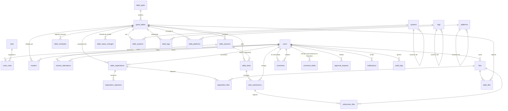

# Modelo de datos — v1

> Schema objetivo de v1, resultado de la revisión de agosto de 2026. Cualquier cambio en una `@Entity` de `backend/` se refleja aquí **en el mismo cambio** (skill `er-diagram-sync`).
>
> El **porqué** de cada cosa está en `decisiones.md`; acá está el **qué**. Las referencias `#n` apuntan a las decisiones cerradas de ese documento.
>
> **Alcance v1**: el schema heredado consolidado, corregido y ampliado con lo que la revisión sacó a la luz. **Campañas y Temporadas quedan fuera a propósito** (`decisiones.md` #7), igual que la integración profunda con Discord.

## 1. Convenciones

| Tema | Convención | Ref. |
|---|---|---|
| Nombre de tabla | `snake_case`, plural, minúsculas | — |
| Nombre de columna | `snake_case` singular. FK = `<entidad_singular>_id` | — |
| Clave primaria | Siempre `id`, `VARCHAR(64)`, UUID v7 generado en la aplicación | #9 |
| Enums | Columna `VARCHAR(32)` + `enum` de Java con `@Enumerated(EnumType.STRING)`. Nunca el tipo `ENUM` de MySQL | #10 |
| Borrado | **Soft delete**: columna `status` con el valor `Deleted` **y** `deleted_at DATETIME NULL` con la fecha. Toda lectura filtra por estado | #25 |
| Cascadas | Se resuelven en el **service layer**, nunca con `ON DELETE CASCADE`. Un borrado arrastra a sus dependientes con la **misma** marca de tiempo, en una transacción | #25 |
| Fechas y horas | **Todo en UTC.** No existe ninguna columna `timezone`: la conversión a hora local la hace el frontend con la zona del navegador | #22 |
| Timestamps | `created_at DATETIME NOT NULL`, `updated_at DATETIME NULL`, `deleted_at DATETIME NULL` donde aplique | #25 |
| Texto enriquecido | `LONGTEXT` en la tabla que lo necesita. **Nunca** una fila de `files`. Se sanitiza al guardar y al servir | #62 |
| Charset | `utf8mb4` / `utf8mb4_unicode_ci` | — |

## 2. Qué cambió respecto al schema heredado

El detalle y el razonamiento están en `decisiones.md`. Resumen de lo estructural:

| Área | Cambio | Ref. |
|---|---|---|
| Nombres | `Tables` → `game_tables`, `Users_registration` → `table_registrations`, `Users_Rejected` → `registration_rejections`, `Days` → `table_schedules`, `Logs` → `audit_logs` | — |
| Zona horaria | **Se eliminan** `users.timezone` y `game_tables.timezone` | #22 |
| Roles | Son **cuatro**: `Player`, `Master`, `Admin`, `Owner`. Acumulables, sin jerarquía | #37, #67 |
| Rol de mesa | `masters.master_type` pasa de `Owner`/`Master` a **`Primary`/`Secondary`** | #71 |
| Postulaciones | **Se quita** el `UNIQUE (game_table_id, user_id)`: un usuario puede postularse N veces | #23 |
| Contador de jugadores | Se elimina `Players_Table`; se deriva con `COUNT`. Se agrega `max_players` | #11, #24 |
| Sesiones | Tabla nueva `table_sessions`, materializada, con asistencia | #33, #36 |
| Peticiones | Tablas nuevas `table_tasks` + `task_submissions` + `submission_files` | #63 |
| Comentarios | **Se elimina `comments.user_created_id`**. El autor vive solo en `comment_drafts` y desaparece al confirmar. Cuota antispam como token opaco | #43, #49, #82 |
| Catálogos | `parent_id` → **`canonical_id`**, profundidad 1. Son grupos de sinónimos, no jerarquía | #53, #59 |
| Archivos | `file_type` (`Public`/`Private`/`Single-use`) y `size_bytes`, que el código usaba y el DDL nunca tuvo. Más `content_hash`, `storage_key` y `last_used_at` | #60, #68, #75, #80 |
| Aprobaciones | `requests` se absorbe en **`approval_requests`**, un solo mecanismo para todos los pedidos con aprobación | #42, #78 |
| Moderación de mesa | Tabla nueva `table_status_changes` con la justificación de cada transición | #32 |
| Feedback del sistema | Tablas nuevas `system_feedback` y `feedback_quotas`. El tipo `General` sale de `comments` | #91, #93, #94 |
| Bandeja de admins | `claimed_by` / `claimed_at` en `approval_requests`, `comments`, `system_feedback` y `game_tables` | #100 |
| PK y tipos rotos | Se corrigen los PK inválidos de `Platforms`/`Tags`/`Systems`, se agregan PK a `registration_rejections` y `audit_logs`, y `Files.mine` pasa a `mime_type VARCHAR(128)` | — |

## 3. Diagrama entidad-relación

Vista general, sin columnas — están en el DDL de §4.

Para verlo por subsistema y con columnas: `diagramas/11` a `16`. Los ciclos de vida (mesa, postulación, comentario) están en `diagramas/05`, `06` y `07`.



`comment_quotas`, `feedback_quotas` y `system_feedback` no aparecen: no tienen relación con ninguna tabla, a propósito — son las piezas anónimas del modelo (#82, #93, #94).

## 4. DDL baseline

Contenido de `backend/src/main/resources/db/migration/V1__baseline.sql` cuando se scaffoldee el backend.

```sql
SET NAMES utf8mb4;

-- ---------------------------------------------------------------- identity

CREATE TABLE users (
    id               VARCHAR(64)  NOT NULL,
    discord_id       VARCHAR(32)  NOT NULL,
    discord_username VARCHAR(64)  NOT NULL,
    name             VARCHAR(64)  NULL,                    -- display name, set at onboarding (#134)
    karma            INT          NOT NULL DEFAULT 8000,  -- cached projection (#97)
    karma_updated_at DATETIME     NULL,                    -- last recalculation
    country          CHAR(2)      NULL,                    -- ISO 3166-1 alpha-2, set at onboarding (#134)
    status           VARCHAR(32)  NOT NULL DEFAULT 'Allowed',
    created_at       DATETIME     NOT NULL,
    updated_at       DATETIME     NULL,
    deleted_at       DATETIME     NULL,
    CONSTRAINT pk_users PRIMARY KEY (id),
    CONSTRAINT uk_users_discord_id UNIQUE (discord_id),
    CONSTRAINT ck_users_karma CHECK (karma BETWEEN 0 AND 10000)
) ENGINE=InnoDB DEFAULT CHARSET=utf8mb4 COLLATE=utf8mb4_unicode_ci;

CREATE TABLE roles (
    id          VARCHAR(64)  NOT NULL,
    name        VARCHAR(32)  NOT NULL,
    description VARCHAR(256) NULL,
    CONSTRAINT pk_roles PRIMARY KEY (id),
    CONSTRAINT uk_roles_name UNIQUE (name)
) ENGINE=InnoDB DEFAULT CHARSET=utf8mb4 COLLATE=utf8mb4_unicode_ci;

CREATE TABLE users_roles (
    user_id    VARCHAR(64) NOT NULL,
    role_id    VARCHAR(64) NOT NULL,
    status     VARCHAR(32) NOT NULL DEFAULT 'Allowed',
    created_at DATETIME    NOT NULL,
    deleted_at DATETIME    NULL,
    CONSTRAINT pk_users_roles PRIMARY KEY (user_id, role_id),
    CONSTRAINT fk_users_roles_user FOREIGN KEY (user_id) REFERENCES users (id),
    CONSTRAINT fk_users_roles_role FOREIGN KEY (role_id) REFERENCES roles (id)
) ENGINE=InnoDB DEFAULT CHARSET=utf8mb4 COLLATE=utf8mb4_unicode_ci;

-- ---------------------------------------------------------------- game table

CREATE TABLE table_types (
    id          VARCHAR(64)  NOT NULL,
    name        VARCHAR(64)  NOT NULL,
    description VARCHAR(256) NULL,
    status      VARCHAR(32)  NOT NULL DEFAULT 'Created',
    created_at  DATETIME     NOT NULL,
    updated_at  DATETIME     NULL,
    deleted_at  DATETIME     NULL,
    CONSTRAINT pk_table_types PRIMARY KEY (id),
    CONSTRAINT uk_table_types_name UNIQUE (name)
) ENGINE=InnoDB DEFAULT CHARSET=utf8mb4 COLLATE=utf8mb4_unicode_ci;

CREATE TABLE game_tables (
    id             VARCHAR(64)   NOT NULL,
    table_type_id  VARCHAR(64)   NULL,
    name           VARCHAR(128)  NOT NULL,
    description    LONGTEXT      NULL,
    permitted      LONGTEXT      NULL,
    requirements   LONGTEXT      NULL,   -- rich text (#62)
    start_date     DATETIME      NULL,   -- UTC (#22)
    duration       TIME          NULL,   -- duration of ONE session
    total_sessions INT           NULL,   -- planned number of sessions (#26)
    max_players    INT           NULL,   -- player cap (#24)
    status         VARCHAR(32)   NOT NULL DEFAULT 'Preparation',
    created_by     VARCHAR(64)   NOT NULL, -- master or admin (#72)
    claimed_by     VARCHAR(64)   NULL,     -- admin who reserved the review (#100)
    claimed_at     DATETIME      NULL,
    closed_at      DATETIME      NULL,   -- set when entering Finished or Canceled (#44)
    created_at     DATETIME      NOT NULL,
    updated_at     DATETIME      NULL,
    deleted_at     DATETIME      NULL,
    CONSTRAINT pk_game_tables PRIMARY KEY (id),
    CONSTRAINT fk_game_tables_type    FOREIGN KEY (table_type_id) REFERENCES table_types (id),
    CONSTRAINT fk_game_tables_creator FOREIGN KEY (created_by)    REFERENCES users (id),
    CONSTRAINT fk_game_tables_claimed FOREIGN KEY (claimed_by)    REFERENCES users (id)
) ENGINE=InnoDB DEFAULT CHARSET=utf8mb4 COLLATE=utf8mb4_unicode_ci;

CREATE INDEX ix_game_tables_status ON game_tables (status);
CREATE INDEX ix_game_tables_type   ON game_tables (table_type_id);
CREATE INDEX ix_game_tables_closed ON game_tables (closed_at);

CREATE TABLE masters (
    game_table_id VARCHAR(64) NOT NULL,
    user_id       VARCHAR(64) NOT NULL,
    master_type   VARCHAR(32) NOT NULL DEFAULT 'Secondary',  -- Primary | Secondary (#71)
    status        VARCHAR(32) NOT NULL DEFAULT 'Created',
    created_at    DATETIME    NOT NULL,
    deleted_at    DATETIME    NULL,
    CONSTRAINT pk_masters PRIMARY KEY (game_table_id, user_id),
    CONSTRAINT fk_masters_table FOREIGN KEY (game_table_id) REFERENCES game_tables (id),
    CONSTRAINT fk_masters_user  FOREIGN KEY (user_id)       REFERENCES users (id)
) ENGINE=InnoDB DEFAULT CHARSET=utf8mb4 COLLATE=utf8mb4_unicode_ci;

-- Exactly one live Primary per table (#73). MySQL has no partial unique
-- indexes, so MasterService enforces this invariant.

CREATE TABLE table_schedules (
    game_table_id VARCHAR(64) NOT NULL,
    weekday       VARCHAR(16) NOT NULL,
    hourtime      TIME        NOT NULL,   -- UTC (#22)
    status        VARCHAR(32) NOT NULL DEFAULT 'Created',
    deleted_at    DATETIME    NULL,
    CONSTRAINT pk_table_schedules PRIMARY KEY (game_table_id, weekday, hourtime),
    CONSTRAINT fk_table_schedules_table FOREIGN KEY (game_table_id) REFERENCES game_tables (id)
) ENGINE=InnoDB DEFAULT CHARSET=utf8mb4 COLLATE=utf8mb4_unicode_ci;

CREATE TABLE table_sessions (
    id              VARCHAR(64) NOT NULL,
    game_table_id   VARCHAR(64) NOT NULL,
    sequence_number INT         NOT NULL,   -- 1..total_sessions
    scheduled_at    DATETIME    NOT NULL,   -- UTC
    status          VARCHAR(32) NOT NULL DEFAULT 'Scheduled', -- Scheduled | Held | Cancelled
    notes           LONGTEXT    NULL,
    created_at      DATETIME    NOT NULL,
    updated_at      DATETIME    NULL,
    deleted_at      DATETIME    NULL,
    CONSTRAINT pk_table_sessions PRIMARY KEY (id),
    CONSTRAINT uk_table_sessions UNIQUE (game_table_id, sequence_number),
    CONSTRAINT fk_table_sessions_table FOREIGN KEY (game_table_id) REFERENCES game_tables (id)
) ENGINE=InnoDB DEFAULT CHARSET=utf8mb4 COLLATE=utf8mb4_unicode_ci;

CREATE INDEX ix_table_sessions_sched ON table_sessions (game_table_id, scheduled_at);

CREATE TABLE session_attendance (
    table_session_id VARCHAR(64) NOT NULL,
    user_id          VARCHAR(64) NOT NULL,
    attendance       VARCHAR(32) NOT NULL DEFAULT 'Unknown', -- Present | Absent | Excused | Unknown
    created_at       DATETIME    NOT NULL,
    updated_at       DATETIME    NULL,
    CONSTRAINT pk_session_attendance PRIMARY KEY (table_session_id, user_id),
    CONSTRAINT fk_session_attendance_session FOREIGN KEY (table_session_id) REFERENCES table_sessions (id),
    CONSTRAINT fk_session_attendance_user    FOREIGN KEY (user_id)          REFERENCES users (id)
) ENGINE=InnoDB DEFAULT CHARSET=utf8mb4 COLLATE=utf8mb4_unicode_ci;

-- Covering index for the historical attendance count (#137): the PK leads with
-- table_session_id, so it cannot serve a lookup by user. This one makes the
-- aggregate index-only — it never touches the rows.
CREATE INDEX ix_session_attendance_user ON session_attendance (user_id, attendance);

CREATE TABLE table_status_changes (
    id            VARCHAR(64)  NOT NULL,
    game_table_id VARCHAR(64)  NOT NULL,
    from_status   VARCHAR(32)  NOT NULL,
    to_status     VARCHAR(32)  NOT NULL,
    changed_by    VARCHAR(64)  NOT NULL,
    justification LONGTEXT     NULL,     -- required for Pause and Canceled (#32)
    created_at    DATETIME     NOT NULL,
    CONSTRAINT pk_table_status_changes PRIMARY KEY (id),
    CONSTRAINT fk_tsc_table FOREIGN KEY (game_table_id) REFERENCES game_tables (id),
    CONSTRAINT fk_tsc_user  FOREIGN KEY (changed_by)    REFERENCES users (id)
) ENGINE=InnoDB DEFAULT CHARSET=utf8mb4 COLLATE=utf8mb4_unicode_ci;

CREATE INDEX ix_tsc_table ON table_status_changes (game_table_id, created_at);

-- ---------------------------------------------------------------- player intake

CREATE TABLE table_registrations (
    id            VARCHAR(64) NOT NULL,
    game_table_id VARCHAR(64) NOT NULL,
    user_id       VARCHAR(64) NOT NULL,
    status        VARCHAR(32) NOT NULL DEFAULT 'Candidate',
    description   LONGTEXT    NULL,   -- rich text, optional (#62, #69)
    created_at    DATETIME    NOT NULL,
    updated_at    DATETIME    NULL,
    deleted_at    DATETIME    NULL,
    CONSTRAINT pk_table_registrations PRIMARY KEY (id),
    CONSTRAINT fk_table_registrations_table FOREIGN KEY (game_table_id) REFERENCES game_tables (id),
    CONSTRAINT fk_table_registrations_user  FOREIGN KEY (user_id)       REFERENCES users (id)
) ENGINE=InnoDB DEFAULT CHARSET=utf8mb4 COLLATE=utf8mb4_unicode_ci;

-- NO UNIQUE (game_table_id, user_id): N applications are allowed (#23).
-- At most ONE active row (Candidate or Player) per pair -- enforced by
-- RegistrationService, since MySQL has no partial unique indexes (#28).
CREATE INDEX ix_table_registrations_status ON table_registrations (game_table_id, status);
CREATE INDEX ix_table_registrations_user   ON table_registrations (user_id, status);

CREATE TABLE registration_rejections (
    id              VARCHAR(64) NOT NULL,
    registration_id VARCHAR(64) NOT NULL,
    description     LONGTEXT    NULL,   -- required (#28 rule 5)
    rejected_at     DATETIME    NOT NULL,
    rejected_by     VARCHAR(64) NULL,   -- NULL = automatic rejection because the table filled up (#34)
    CONSTRAINT pk_registration_rejections PRIMARY KEY (id),
    CONSTRAINT fk_rr_registration FOREIGN KEY (registration_id) REFERENCES table_registrations (id),
    CONSTRAINT fk_rr_user         FOREIGN KEY (rejected_by)     REFERENCES users (id)
) ENGINE=InnoDB DEFAULT CHARSET=utf8mb4 COLLATE=utf8mb4_unicode_ci;

-- ---------------------------------------------------------------- table tasks

CREATE TABLE table_tasks (
    id               VARCHAR(64)  NOT NULL,
    game_table_id    VARCHAR(64)  NOT NULL,
    table_session_id VARCHAR(64)  NULL,   -- NULL = not tied to a session (#63)
    audience         VARCHAR(32)  NOT NULL, -- Candidates | Players | Single
    target_user_id   VARCHAR(64)  NULL,   -- only when audience = 'Single'
    title            VARCHAR(128) NOT NULL,
    description      LONGTEXT     NULL,   -- rich text (#62)
    accepts_text     BOOLEAN      NOT NULL DEFAULT TRUE,
    accepts_files    BOOLEAN      NOT NULL DEFAULT TRUE,
    is_mandatory     BOOLEAN      NOT NULL DEFAULT FALSE, -- informational only, does not block (#70)
    due_at           DATETIME     NULL,
    status           VARCHAR(32)  NOT NULL DEFAULT 'Open',
    created_at       DATETIME     NOT NULL,
    updated_at       DATETIME     NULL,
    deleted_at       DATETIME     NULL,
    CONSTRAINT pk_table_tasks PRIMARY KEY (id),
    CONSTRAINT fk_task_table   FOREIGN KEY (game_table_id)    REFERENCES game_tables (id),
    CONSTRAINT fk_task_session FOREIGN KEY (table_session_id) REFERENCES table_sessions (id),
    CONSTRAINT fk_task_target  FOREIGN KEY (target_user_id)   REFERENCES users (id),
    CONSTRAINT ck_task_accepts CHECK (accepts_text = TRUE OR accepts_files = TRUE)
) ENGINE=InnoDB DEFAULT CHARSET=utf8mb4 COLLATE=utf8mb4_unicode_ci;

CREATE INDEX ix_task_table ON table_tasks (game_table_id, audience, status);

CREATE TABLE task_submissions (
    id             VARCHAR(64) NOT NULL,
    task_id VARCHAR(64) NOT NULL,
    user_id        VARCHAR(64) NOT NULL,
    content        LONGTEXT    NULL,   -- rich text (#62)
    status         VARCHAR(32) NOT NULL DEFAULT 'Pending', -- Pending | Submitted (#76)
    submitted_at   DATETIME    NULL,
    created_at     DATETIME    NOT NULL,
    updated_at     DATETIME    NULL,
    deleted_at     DATETIME    NULL,
    CONSTRAINT pk_task_submissions PRIMARY KEY (id),
    CONSTRAINT fk_tsub_task FOREIGN KEY (task_id) REFERENCES table_tasks (id),
    CONSTRAINT fk_tsub_user        FOREIGN KEY (user_id)        REFERENCES users (id)
) ENGINE=InnoDB DEFAULT CHARSET=utf8mb4 COLLATE=utf8mb4_unicode_ci;

CREATE INDEX ix_tsub_task ON task_submissions (task_id, user_id);

-- ---------------------------------------------------------------- files

CREATE TABLE files (
    id              VARCHAR(64)  NOT NULL,
    name            VARCHAR(256) NOT NULL,  -- original filename, metadata only (#80)
    storage_key     VARCHAR(256) NOT NULL,  -- actual name on disk = id (#80)
    content_hash    CHAR(64)     NULL,      -- SHA-256, used for deduplication (#75)
    mime_type       VARCHAR(128) NOT NULL,
    size_bytes      BIGINT       NOT NULL,
    file_type       VARCHAR(32)  NOT NULL DEFAULT 'Single-use', -- Public|Private|Single-use (#68)
    public_audience VARCHAR(32)  NULL,      -- Masters|Players|Announcements (#64)
    user_created_id VARCHAR(64)  NOT NULL,
    last_used_at    DATETIME     NULL,      -- drives the unused-file purge (#75)
    status          VARCHAR(32)  NOT NULL DEFAULT 'Current',
    created_at      DATETIME     NOT NULL,
    deleted_at      DATETIME     NULL,
    CONSTRAINT pk_files PRIMARY KEY (id),
    CONSTRAINT uk_files_storage_key UNIQUE (storage_key),
    CONSTRAINT fk_files_user FOREIGN KEY (user_created_id) REFERENCES users (id)
) ENGINE=InnoDB DEFAULT CHARSET=utf8mb4 COLLATE=utf8mb4_unicode_ci;

CREATE INDEX ix_files_owner    ON files (user_created_id, file_type, status);
CREATE INDEX ix_files_hash     ON files (content_hash);
CREATE INDEX ix_files_lastused ON files (last_used_at);

CREATE TABLE table_files (
    game_table_id   VARCHAR(64) NOT NULL,
    file_id         VARCHAR(64) NOT NULL,
    table_file_type VARCHAR(32) NOT NULL DEFAULT 'Preparation', -- Preparation | Session
    is_private      BOOLEAN     NOT NULL DEFAULT FALSE,
    status          VARCHAR(32) NOT NULL DEFAULT 'Current',
    created_at      DATETIME    NOT NULL,
    deleted_at      DATETIME    NULL,
    CONSTRAINT pk_table_files PRIMARY KEY (game_table_id, file_id),
    CONSTRAINT fk_table_files_table FOREIGN KEY (game_table_id) REFERENCES game_tables (id),
    CONSTRAINT fk_table_files_file  FOREIGN KEY (file_id)       REFERENCES files (id)
) ENGINE=InnoDB DEFAULT CHARSET=utf8mb4 COLLATE=utf8mb4_unicode_ci;

CREATE TABLE registration_files (
    registration_id VARCHAR(64) NOT NULL,
    file_id         VARCHAR(64) NOT NULL,
    status          VARCHAR(32) NOT NULL DEFAULT 'Current',
    created_at      DATETIME    NOT NULL,
    deleted_at      DATETIME    NULL,
    CONSTRAINT pk_registration_files PRIMARY KEY (registration_id, file_id),
    CONSTRAINT fk_rf_registration FOREIGN KEY (registration_id) REFERENCES table_registrations (id),
    CONSTRAINT fk_rf_file         FOREIGN KEY (file_id)         REFERENCES files (id)
) ENGINE=InnoDB DEFAULT CHARSET=utf8mb4 COLLATE=utf8mb4_unicode_ci;

CREATE TABLE submission_files (
    submission_id VARCHAR(64) NOT NULL,
    file_id       VARCHAR(64) NOT NULL,
    status        VARCHAR(32) NOT NULL DEFAULT 'Current',
    created_at    DATETIME    NOT NULL,
    deleted_at    DATETIME    NULL,
    CONSTRAINT pk_submission_files PRIMARY KEY (submission_id, file_id),
    CONSTRAINT fk_sf_submission FOREIGN KEY (submission_id) REFERENCES task_submissions (id),
    CONSTRAINT fk_sf_file       FOREIGN KEY (file_id)       REFERENCES files (id)
) ENGINE=InnoDB DEFAULT CHARSET=utf8mb4 COLLATE=utf8mb4_unicode_ci;

-- ---------------------------------------------------------------- catalogs

CREATE TABLE systems (
    id           VARCHAR(64)  NOT NULL,
    name         VARCHAR(128) NOT NULL,
    canonical_id VARCHAR(64)  NULL,   -- NULL = this row is the group's canonical entry (#59)
    status       VARCHAR(32)  NOT NULL DEFAULT 'Created',
    created_at   DATETIME     NOT NULL,
    updated_at   DATETIME     NULL,
    deleted_at   DATETIME     NULL,
    CONSTRAINT pk_systems PRIMARY KEY (id),
    CONSTRAINT uk_systems_name UNIQUE (name),
    CONSTRAINT fk_systems_canonical FOREIGN KEY (canonical_id) REFERENCES systems (id)
) ENGINE=InnoDB DEFAULT CHARSET=utf8mb4 COLLATE=utf8mb4_unicode_ci;

CREATE INDEX ix_systems_canonical ON systems (canonical_id);

CREATE TABLE tags (
    id           VARCHAR(64)  NOT NULL,
    name         VARCHAR(128) NOT NULL,
    canonical_id VARCHAR(64)  NULL,
    status       VARCHAR(32)  NOT NULL DEFAULT 'Created',
    created_at   DATETIME     NOT NULL,
    updated_at   DATETIME     NULL,
    deleted_at   DATETIME     NULL,
    CONSTRAINT pk_tags PRIMARY KEY (id),
    CONSTRAINT uk_tags_name UNIQUE (name),
    CONSTRAINT fk_tags_canonical FOREIGN KEY (canonical_id) REFERENCES tags (id)
) ENGINE=InnoDB DEFAULT CHARSET=utf8mb4 COLLATE=utf8mb4_unicode_ci;

CREATE INDEX ix_tags_canonical ON tags (canonical_id);

CREATE TABLE platforms (
    id           VARCHAR(64)  NOT NULL,
    name         VARCHAR(128) NOT NULL,
    canonical_id VARCHAR(64)  NULL,
    status       VARCHAR(32)  NOT NULL DEFAULT 'Created',
    created_at   DATETIME     NOT NULL,
    updated_at   DATETIME     NULL,
    deleted_at   DATETIME     NULL,
    CONSTRAINT pk_platforms PRIMARY KEY (id),
    CONSTRAINT uk_platforms_name UNIQUE (name),
    CONSTRAINT fk_platforms_canonical FOREIGN KEY (canonical_id) REFERENCES platforms (id)
) ENGINE=InnoDB DEFAULT CHARSET=utf8mb4 COLLATE=utf8mb4_unicode_ci;

CREATE INDEX ix_platforms_canonical ON platforms (canonical_id);

-- Always depth 1: an alias points at the canonical entry, never at another
-- alias (#59). CatalogService enforces it: the target canonical_id must
-- itself have canonical_id NULL.

CREATE TABLE table_systems (
    game_table_id VARCHAR(64) NOT NULL,
    system_id     VARCHAR(64) NOT NULL,
    status        VARCHAR(32) NOT NULL DEFAULT 'Used',
    created_at    DATETIME    NOT NULL,
    deleted_at    DATETIME    NULL,
    CONSTRAINT pk_table_systems PRIMARY KEY (game_table_id, system_id),
    CONSTRAINT fk_ts_table  FOREIGN KEY (game_table_id) REFERENCES game_tables (id),
    CONSTRAINT fk_ts_system FOREIGN KEY (system_id)     REFERENCES systems (id)
) ENGINE=InnoDB DEFAULT CHARSET=utf8mb4 COLLATE=utf8mb4_unicode_ci;

CREATE TABLE table_tags (
    game_table_id VARCHAR(64) NOT NULL,
    tag_id        VARCHAR(64) NOT NULL,
    status        VARCHAR(32) NOT NULL DEFAULT 'Used',
    created_at    DATETIME    NOT NULL,
    deleted_at    DATETIME    NULL,
    CONSTRAINT pk_table_tags PRIMARY KEY (game_table_id, tag_id),
    CONSTRAINT fk_tt_table FOREIGN KEY (game_table_id) REFERENCES game_tables (id),
    CONSTRAINT fk_tt_tag   FOREIGN KEY (tag_id)        REFERENCES tags (id)
) ENGINE=InnoDB DEFAULT CHARSET=utf8mb4 COLLATE=utf8mb4_unicode_ci;

CREATE TABLE table_platforms (
    game_table_id VARCHAR(64) NOT NULL,
    platform_id   VARCHAR(64) NOT NULL,
    status        VARCHAR(32) NOT NULL DEFAULT 'Used',
    created_at    DATETIME    NOT NULL,
    deleted_at    DATETIME    NULL,
    CONSTRAINT pk_table_platforms PRIMARY KEY (game_table_id, platform_id),
    CONSTRAINT fk_tp_table    FOREIGN KEY (game_table_id) REFERENCES game_tables (id),
    CONSTRAINT fk_tp_platform FOREIGN KEY (platform_id)   REFERENCES platforms (id)
) ENGINE=InnoDB DEFAULT CHARSET=utf8mb4 COLLATE=utf8mb4_unicode_ci;

-- ---------------------------------------------------------------- comments

-- Draft: the ONLY table that knows the author (#49). On confirmation the
-- anonymous row in `comments` is created, the quota row is written and this
-- row is deleted. On expiry or table cancellation, author_id and content are
-- wiped (#52).
CREATE TABLE comment_drafts (
    id              VARCHAR(64) NOT NULL,
    author_id       VARCHAR(64) NULL,   -- wiped on expiry (#52)
    target_user_id  VARCHAR(64) NOT NULL,
    game_table_id   VARCHAR(64) NOT NULL,
    content         LONGTEXT    NULL,   -- wiped on expiry (#52)
    comment_type    VARCHAR(32) NOT NULL,  -- JJ | JM | MJ  (General lives in system_feedback)
    karma_impact    VARCHAR(32) NOT NULL DEFAULT 'Neutral',
    status          VARCHAR(32) NOT NULL DEFAULT 'Draft', -- Draft | Confirmed | Expired
    created_at      DATETIME    NOT NULL,
    updated_at      DATETIME    NULL,
    deleted_at      DATETIME    NULL,
    CONSTRAINT pk_comment_drafts PRIMARY KEY (id),
    CONSTRAINT fk_cd_author FOREIGN KEY (author_id)      REFERENCES users (id),
    CONSTRAINT fk_cd_target FOREIGN KEY (target_user_id) REFERENCES users (id),
    CONSTRAINT fk_cd_table  FOREIGN KEY (game_table_id)  REFERENCES game_tables (id)
) ENGINE=InnoDB DEFAULT CHARSET=utf8mb4 COLLATE=utf8mb4_unicode_ci;

CREATE INDEX ix_cd_author ON comment_drafts (author_id, game_table_id);

-- Confirmed comment: ANONYMOUS. No author and no table, on purpose (#43, M15).
CREATE TABLE comments (
    id                VARCHAR(64) NOT NULL,
    user_commented_id VARCHAR(64) NOT NULL,  -- recipient, always known (#51)
    description       LONGTEXT    NOT NULL,
    comment_type      VARCHAR(32) NOT NULL,  -- JJ | JM | MJ  (General lives in system_feedback)
    karma_impact      VARCHAR(32) NOT NULL DEFAULT 'Neutral',
    status            VARCHAR(32) NOT NULL DEFAULT 'Under review',
    claimed_by        VARCHAR(64) NULL,      -- admin who reserved it for moderation (#100)
    claimed_at        DATETIME    NULL,
    user_reviewed_id  VARCHAR(64) NULL,      -- the admin who moderated it (#51)
    created_at        DATETIME    NOT NULL,  -- (#82)
    reviewed_at       DATETIME    NULL,
    deleted_at        DATETIME    NULL,
    CONSTRAINT pk_comments PRIMARY KEY (id),
    CONSTRAINT fk_comments_claimed   FOREIGN KEY (claimed_by)        REFERENCES users (id),
    CONSTRAINT fk_comments_commented FOREIGN KEY (user_commented_id) REFERENCES users (id),
    CONSTRAINT fk_comments_reviewed  FOREIGN KEY (user_reviewed_id)  REFERENCES users (id)
) ENGINE=InnoDB DEFAULT CHARSET=utf8mb4 COLLATE=utf8mb4_unicode_ci;

CREATE INDEX ix_comments_commented ON comments (user_commented_id, status);
CREATE INDEX ix_comments_review    ON comments (status, created_at);

-- Anti-spam quota: one comment per author about the same person per table (#35).
-- Stores HMAC(secret, author+target+table), NEVER the plaintext tuple (#82).
-- Intentionally has no foreign keys.
CREATE TABLE comment_quotas (
    quota_token CHAR(64)  NOT NULL,
    created_at  DATETIME  NOT NULL,
    CONSTRAINT pk_comment_quotas PRIMARY KEY (quota_token)
) ENGINE=InnoDB DEFAULT CHARSET=utf8mb4 COLLATE=utf8mb4_unicode_ci;

-- Feedback about the SYSTEM, not about a person (#91). Anonymous like comments
-- (#93) but simpler: it is created without an author, so it needs none of the
-- draft machinery from #48.
CREATE TABLE system_feedback (
    id         VARCHAR(64) NOT NULL,
    content    LONGTEXT    NOT NULL,
    status     VARCHAR(32) NOT NULL DEFAULT 'New', -- New | Reviewed | Discarded
                                                   -- READ state, not moderation (#95)
    claimed_by VARCHAR(64) NULL,                   -- admin who reserved it (#100)
    claimed_at DATETIME    NULL,
    created_at DATETIME    NOT NULL,
    deleted_at DATETIME    NULL,
    CONSTRAINT pk_system_feedback PRIMARY KEY (id),
    CONSTRAINT fk_sf_claimed FOREIGN KEY (claimed_by) REFERENCES users (id)
) ENGINE=InnoDB DEFAULT CHARSET=utf8mb4 COLLATE=utf8mb4_unicode_ci;

CREATE INDEX ix_system_feedback ON system_feedback (status, created_at);

-- One every 24 real hours (#94). Token is HMAC(secret, user_id + UTC hour),
-- never the user_id. To check, the service computes the tokens for the last 24
-- hourly buckets and looks for any match. The token ROTATES hourly on purpose:
-- a fixed per-user token would be a permanent pseudonym and would allow
-- grouping someone's submissions. Rows are purged after 24 h.
CREATE TABLE feedback_quotas (
    quota_token CHAR(64) NOT NULL,
    created_at  DATETIME NOT NULL,
    CONSTRAINT pk_feedback_quotas PRIMARY KEY (quota_token)
) ENGINE=InnoDB DEFAULT CHARSET=utf8mb4 COLLATE=utf8mb4_unicode_ci;

CREATE INDEX ix_feedback_quotas_created ON feedback_quotas (created_at);

-- ---------------------------------------------------------------- cross-cutting

-- Single mechanism for every request that needs approval (#42).
-- Polymorphic reference with no FK: ApprovalService validates entity_id exists,
-- and that check ships with its unit test (#78, #126).
CREATE TABLE approval_requests (
    id              VARCHAR(64)  NOT NULL,
    request_type    VARCHAR(32)  NOT NULL, -- TablePause | PlayerBan | MasterGrant | TableOpen | General (#90)
    entity_type     VARCHAR(32)  NOT NULL, -- game_table | table_registration | user
    entity_id       VARCHAR(64)  NOT NULL,
    requested_by    VARCHAR(64)  NOT NULL,
    justification   LONGTEXT     NOT NULL,
    status          VARCHAR(32)  NOT NULL DEFAULT 'Pending', -- Pending | Approved | Rejected
    claimed_by      VARCHAR(64)  NULL,  -- admin who reserved this item (#100)
    claimed_at      DATETIME     NULL,  -- auto-released after a timeout (#100)
    resolved_by     VARCHAR(64)  NULL,
    resolution_note LONGTEXT     NULL,
    resolved_at     DATETIME     NULL,
    created_at      DATETIME     NOT NULL,
    deleted_at      DATETIME     NULL,
    CONSTRAINT pk_approval_requests PRIMARY KEY (id),
    CONSTRAINT fk_ar_claimed   FOREIGN KEY (claimed_by)   REFERENCES users (id),
    CONSTRAINT fk_ar_requested FOREIGN KEY (requested_by) REFERENCES users (id),
    CONSTRAINT fk_ar_resolved  FOREIGN KEY (resolved_by)  REFERENCES users (id)
) ENGINE=InnoDB DEFAULT CHARSET=utf8mb4 COLLATE=utf8mb4_unicode_ci;

CREATE INDEX ix_ar_pending ON approval_requests (status, claimed_by, created_at);
CREATE INDEX ix_ar_entity  ON approval_requests (entity_type, entity_id);

CREATE TABLE notifications (
    id                  VARCHAR(64)   NOT NULL,
    user_id             VARCHAR(64)   NOT NULL,
    notification_type   VARCHAR(32)   NOT NULL,
    title               VARCHAR(128)  NOT NULL,
    message             VARCHAR(1024) NULL,
    related_entity_type VARCHAR(32)   NULL,
    related_entity_id   VARCHAR(64)   NULL,
    read_status         VARCHAR(32)   NOT NULL DEFAULT 'Unread',
    created_at          DATETIME      NOT NULL,
    read_at             DATETIME      NULL,
    deleted_at          DATETIME      NULL,
    CONSTRAINT pk_notifications PRIMARY KEY (id),
    CONSTRAINT fk_notifications_user FOREIGN KEY (user_id) REFERENCES users (id)
) ENGINE=InnoDB DEFAULT CHARSET=utf8mb4 COLLATE=utf8mb4_unicode_ci;

CREATE INDEX ix_notifications_inbox ON notifications (user_id, read_status, created_at);

-- "View as" (#140). The admin is stored here and shown ONLY to the Owner: the affected
-- person sees "modificado por un administrador", never a name. Never over Admin or Owner.
-- Declared before audit_logs because audit_logs references it (FK order).
CREATE TABLE impersonation_sessions (
    id             VARCHAR(64)  NOT NULL,
    admin_id       VARCHAR(64)  NOT NULL,
    target_user_id VARCHAR(64)  NOT NULL,
    reason         VARCHAR(255) NOT NULL,  -- mandatory; shown to the target, unlike admin_id
    started_at     DATETIME     NOT NULL,
    ended_at       DATETIME     NULL,      -- auto-closed 30 min after started_at
    CONSTRAINT pk_impersonation_sessions PRIMARY KEY (id),
    CONSTRAINT fk_is_admin  FOREIGN KEY (admin_id)       REFERENCES users (id),
    CONSTRAINT fk_is_target FOREIGN KEY (target_user_id) REFERENCES users (id)
) ENGINE=InnoDB DEFAULT CHARSET=utf8mb4 COLLATE=utf8mb4_unicode_ci;

CREATE INDEX ix_impersonation_target ON impersonation_sessions (target_user_id, started_at);

-- NEVER audits `comments` or `comment_drafts`: it would store author and
-- content together and break anonymity (#43).
CREATE TABLE audit_logs (
    id          VARCHAR(64) NOT NULL,
    entity_type VARCHAR(64) NOT NULL,
    entity_id   VARCHAR(64) NOT NULL,
    action      VARCHAR(16) NOT NULL,  -- Create | Update | Delete
    updated_by  VARCHAR(64) NULL,      -- identity the change happened under, not always who typed it
    impersonation_id VARCHAR(64) NULL, -- set when it happened inside a "view as" (#140)
    before_data JSON        NULL,  -- ONLY the columns that changed (#92)
    after_data  JSON        NULL,  -- ONLY the columns that changed (#92)
    updated_at  TIMESTAMP   NOT NULL DEFAULT CURRENT_TIMESTAMP,
    CONSTRAINT pk_audit_logs PRIMARY KEY (id),
    CONSTRAINT fk_audit_logs_user FOREIGN KEY (updated_by) REFERENCES users (id),
    CONSTRAINT fk_audit_logs_impersonation FOREIGN KEY (impersonation_id)
        REFERENCES impersonation_sessions (id)
) ENGINE=InnoDB DEFAULT CHARSET=utf8mb4 COLLATE=utf8mb4_unicode_ci;

-- Editable configuration (#141). Key-value so adding a setting is not an ALTER TABLE,
-- same reasoning as #10 with ENUMs. Audited like any other entity. NO SECRETS HERE:
-- the HMAC of #94 and every credential stay in the environment.
CREATE TABLE system_settings (
    setting_key VARCHAR(64)  NOT NULL,
    value       VARCHAR(512) NOT NULL,
    value_type  VARCHAR(16)  NOT NULL,  -- Integer | Decimal | Duration | Text | Boolean
    category    VARCHAR(32)  NOT NULL,  -- Business | Limits | Texts
    updated_by  VARCHAR(64)  NULL,
    updated_at  DATETIME     NULL,
    CONSTRAINT pk_system_settings PRIMARY KEY (setting_key),
    CONSTRAINT fk_ss_user FOREIGN KEY (updated_by) REFERENCES users (id)
) ENGINE=InnoDB DEFAULT CHARSET=utf8mb4 COLLATE=utf8mb4_unicode_ci;

CREATE INDEX ix_audit_logs_entity ON audit_logs (entity_type, entity_id);
```

## 5. Reglas de negocio (viven en el service layer)

Ninguna vive en la base: no hay triggers ni stored procedures (#3). Cada una llega con su test unitario.

### Identidad y roles

| Regla | Dónde | Ref. |
|---|---|---|
| Login exige cuenta de Discord y membresía al servidor; si no es miembro se ofrece la invitación antes de cortar | `DiscordOAuth2UserService` | #38 |
| Todo usuario nuevo se crea con rol `Player` | `UserRegistrationService` | #38 |
| Los cuatro roles son acumulables. Única excepción: `Owner` puede todo lo que puede `Admin`. Se escribe `hasAnyRole('ADMIN','OWNER')` en cada endpoint, sin `RoleHierarchy` | `SecurityConfig` | #37, #67, #89 |
| `Owner` y `Admin` **no** implican `Player` ni `Master`: para jugar o dirigir hay que tener ese rol | `SecurityConfig` | #89 |
| **`Admin` y `Owner` son excluyentes**: nadie tiene los dos. Otorgar uno quita el otro — son el mismo rol con distinto alcance, y `Owner` está por encima | `UserRoleService` (llega con `/admin/users`) | #169 |
| **`Admin` y `Owner` son excluyentes**: nadie tiene los dos. Otorgar uno quita el otro — son el mismo rol con distinto alcance, y `Owner` está por encima | `UserRoleService` (llega con `/admin/users`) | #169 |
| Salirse del servidor conserva los datos; el baneo lo marca un admin a mano | `UserService` | #84, M30 |
| El owner puede migrar los datos de un usuario a una cuenta nueva | `UserService` | #83 |

### Solicitudes y aprobaciones

| Regla | Dónde | Ref. |
|---|---|---|
| Un solo mecanismo para todo pedido con aprobación: pausar mesa, vetar jugador, pedir rol de master, pedir que se abra una mesa, peticiones generales | `ApprovalService` | #42, #90 |
| La entidad afectada se referencia de forma polimórfica; **el service valida que exista**, porque la base no puede | `ApprovalService` | #78 |
| Pedir que se abra una mesa desemboca en #72: un admin la crea en `Unassigned` y le asigna master | `ApprovalService` | #90 |

### Mesa

| Regla | Dónde | Ref. |
|---|---|---|
| Máquina de estados: `Unassigned`/`Preparation` → `ChangesRequested` → `Opened` → `InProgress` → `PauseRequested` → `Pause` → `Finished`/`Canceled`. Toda transición no declarada devuelve `409` | `GameTableService` | #27, #32, #72 |
| Una mesa creada por un admin nace `Unassigned` y, al asignarle masters, pasa directo a `Opened` sin revisión | `GameTableService` | #72 |
| Exactamente un `Primary` vivo por mesa | `MasterService` | #71, #73 |
| `Pause` y `Canceled` exigen justificación, que se registra en `table_status_changes` | `GameTableService` | #32 |
| La pausa pedida por un master no aplica hasta que un admin la aprueba (`approval_requests`) | `GameTableService` | #32 |
| `Pause` congela la agenda: las sesiones pendientes dejan de aparecer. Al retomar hay que reagendar | `TableSessionService` | #32, #33 |
| Al entrar en `Finished` o `Canceled` se sella `closed_at`, que arranca la ventana de visibilidad | `GameTableService` | #44, #180 |
| **Un master no puede tener dos mesas vivas con agendas solapadas**. Se compara intervalo contra intervalo —`[hourtime, hourtime + duration)` en UTC, semiabierto y con envoltura semanal—, no `weekday`+`hourtime` exacto | `ScheduleConflictService` | #178 |
| Dos filas de `table_schedules` **de la misma mesa** no pueden solaparse entre sí | `TableScheduleService` | #178 |
| **`Pause` no reserva horario**: congela la agenda, así que sus franjas no cuentan como choque. Al reanudar se reagenda y se vuelve a verificar | `ScheduleConflictService` | #32, #178 |
| Editar la agenda de una mesa ya poblada **avisa** al master a quiénes les genera choque; no expulsa a nadie | `TableScheduleService` | #70, #178 |
| **Una mesa se borra solo si nunca fue pública** (`Unassigned`/`Preparation`/`ChangesRequested`) **y no tiene postulaciones activas**; lo demás se cancela. El borrado es lógico y arrastra `masters` y `table_registrations` con la misma marca de tiempo | `GameTableService.delete` | #25, #175 |
| Una mesa `Deleted` no existe para ninguna lectura: detalle y listados responden `404` o la omiten | `GameTableService` | #25, #175 |

### Postulaciones

| Regla | Dónde | Ref. |
|---|---|---|
| Como máximo una postulación activa (`Candidate` o `Player`) por par mesa/usuario | `RegistrationService` | #28 |
| Los candidatos se atienden en orden de llegada (FIFO por `created_at`), sin reordenar por otro criterio | `RegistrationService` | #28 |
| Solo `Player` cuenta contra `max_players`; un candidato no reserva cupo | `RegistrationService` | #28 |
| Al aceptar al jugador que completa `max_players`, el resto de los `Candidate` pasa a `Rejected` con la justificación `Mesa llena`, y se notifica | `RegistrationService` | #34 |
| Todo `Rejected` genera su fila en `registration_rejections` | `RegistrationService` | #28 |
| Un master solo puede postularse si además tiene el rol `Player` | `RegistrationService` | #73 |
| El veto lo aplica el `Primary`; un `Secondary` lo pide vía `approval_requests` | `RegistrationService` | #39 |
| El veto es reversible; veto y levantamiento quedan registrados | `RegistrationService` | #39 |
| **Filtro de visibilidad**: toda lectura de mesas excluye aquellas donde el usuario tenga una postulación `Blocked`. El detalle por id responde `404`, no `403` | `GameTableService` | #29 |
| Un usuario con `status = 'Blocked'` no puede postularse ni loguearse | `RegistrationService` | — |
| **No se puede postular a una mesa que choca de horario con otra donde ya se es `Player`.** Dirigir y jugar cuentan igual: los compromisos de una persona son sus mesas como master y como jugador | `RegistrationService` | #178 |
| **No se puede aceptar a un candidato que ya es `Player` en una mesa que choca.** Se verifica al aceptar y no solo al postularse: el estado puede haber cambiado entre las dos | `RegistrationService` | #178 |
| Al aceptar a alguien, sus otras postulaciones `Candidate` que chocan **se notifican, no se rechazan**: hasta que lo aceptan en una no hay compromiso y elegir es suyo | `RegistrationService` | #70, #178 |
| **Se puede retirar la propia postulación** mientras esté en `Candidate`. Es el borrado lógico de `table_registrations` que la notificación de choque exige poder resolver | `RegistrationService` | #175, #178 |

### Sesiones y peticiones

| Regla | Dónde | Ref. |
|---|---|---|
| Las sesiones se materializan al pasar a `Opened`, a partir de `start_date` + `table_schedules` + `total_sessions` | `TableSessionService` | #26, #33 |
| La asistencia se registra por sesión y alimenta la evaluación de karma | `TableSessionService` | #36 |
| Publicar una petición notifica a sus destinatarios | `TaskService` | #77 |
| Las entregas se acumulan, nunca se reemplazan; el sistema no juzga si cumplen | `TaskService` | #76 |
| El incumplimiento se avisa y queda visible para el master, pero no bloquea ni expulsa | `TaskService` | #70 |

### Comentarios y karma

| Regla | Dónde | Ref. |
|---|---|---|
| Solo una mesa `Finished` habilita comentar; una `Canceled` no genera comentarios ni karma | `CommentService` | #46 |
| El comentario se escribe como borrador y se confirma al cerrar la mesa; ahí se crea la fila anónima y se borra el borrador | `CommentService` | #48, #49 |
| Un comentario por autor sobre la misma persona por mesa, verificado con el token de `comment_quotas` | `CommentService` | #35, #82 |
| Solo puede comentar quien coincidió con el comentado en la mesa, validado contra la asistencia. **La evidencia se usa y no se persiste** | `CommentService` | #31, #36 |
| El borrador no confirmado expira, con dos avisos previos, y se le purgan autor y contenido | `CommentService` | #50, #52 |
| Todo comentario confirmado pasa por moderación de un admin, que ve contenido y destinatario pero nunca al autor | `CommentModerationService` | #51 |
| El karma se mueve solo con los comentarios aprobados | `CommentModerationService` | #51 |
| **Fórmula**: `karma = 10000 × (W·m + Σ wᵢ·vᵢ) / (W + Σ wᵢ)` con `m=0.8`, `W=20`, `wᵢ=2^(−antigüedad/12 meses)`; `v` vale `1.0` positivo, `0.8` neutro, `0.0` negativo | `KarmaService` | #96 |
| El **neutro vale igual que el prior**: no mueve el promedio pero acumula confianza y amortigua un negativo aislado | `KarmaService` | #96 |
| `users.karma` es una **proyección cacheada**, no la fuente de verdad. La fuente son las filas de `comments` | `KarmaService` | #97 |
| Se recalcula al aprobar un comentario (solo esa persona) y en un **job semanal nocturno** (todos) | `KarmaService` | #97 |
| La asistencia **no** entra en el cálculo: se muestra como métrica aparte | `KarmaService` | #98 |
| Se muestra el puntaje y los comentarios recibidos, sin desglose agregado. El master ve lo mismo que el dueño del perfil | `UserService` | #99 |
| Llegar a 0 o 10000 no dispara ninguna acción automática | `CommentModerationService` | #74 |
| El feedback del sistema vive en `system_feedback`, es anónimo y no guarda autor en ningún momento. Sin destinatario, sin karma y sin mesa | `FeedbackService` | #91, #93 |
| Uno cada 24 h reales: se comprueban los tokens de las últimas 24 franjas horarias en `feedback_quotas` | `FeedbackService` | #94 |
| Las filas de `feedback_quotas` se purgan pasadas 24 h; el token rota por hora y nunca es un identificador estable del usuario | `FeedbackService` | #94 |
| No pasa por moderación: va directo a la bandeja de lectura de admins y owner | `FeedbackService` | #95 |

### Visibilidad de perfiles

| Regla | Dónde | Ref. |
|---|---|---|
| El perfil de un master es visible para cualquiera que mire su mesa | `UserService` | #41 |
| El perfil de un jugador se abre para el master desde que recibe su postulación | `UserService` | #41 |
| Los jugadores de una mesa ven los perfiles de sus compañeros | `UserService` | #47 |
| La visibilidad caduca a las **dos semanas** de `closed_at`. En `Pause` el reloj no corre | `UserService` | #44 |
| El admin no tiene restricciones de visibilidad, salvo la autoría de los comentarios | `UserService` | #45 |

### Catálogos

| Regla | Dónde | Ref. |
|---|---|---|
| Los grupos son de sinónimos, profundidad 1: un alias apunta al canónico, nunca a otro alias | `CatalogService` | #59 |
| Buscar por cualquier miembro devuelve las mesas etiquetadas con cualquier otro del grupo | `CatalogService` | #54, #56 |
| Masters y admins proponen valores; solo un admin acepta y clasifica | `CatalogService` | #55 |
| Un valor en `Created` no filtra ni se muestra a los jugadores; al aceptarse, sí | `CatalogService` | #57 |
| La mesa muestra siempre el alias que le puso su master | `CatalogService` | #58 |
| Dar de baja un valor no rompe vínculos: las lecturas lo saltan por estado y restaurarlo devuelve todo | `CatalogService` | #81 |

### Archivos

| Regla | Dónde | Ref. |
|---|---|---|
| Nombre físico = id del archivo; el nombre original es solo metadato | `StorageService` | #80 |
| El usuario ve y reutiliza todo lo que subió; vincular no duplica | `FileService` | #65 |
| Un master puede usar un archivo `Public` como requisito sin copiarlo; quitarlo de la mesa no borra el archivo global | `FileService` | #79 |
| Los `Single-use` se purgan cuando su contexto termina; el resto, tras ~3 meses sin uso | `FileRetentionService` | #75 |
| Se deduplica por `content_hash` y se comprime al guardar | `FileService` | #75 |
| El borrado físico lo ejecuta el owner desde el menú de administración | `StorageService` | #66 |
| `comments` y `comment_drafts` **nunca** se auditan | `AuditService` | #43 |

### Bandeja compartida de admins

Los ítems de trabajo de admin **no se duplican como notificaciones**: la bandeja es una vista sobre el trabajo pendiente que ya vive en sus tablas.

| Regla | Dónde | Ref. |
|---|---|---|
| La bandeja es un `UNION ALL` sobre `approval_requests` (`Pending`), `comments` (`Under review`), `system_feedback` (`New`) y `game_tables` (`Preparation`/`ChangesRequested`), normalizado a un DTO común | `AdminQueueService` | #100 |
| Un ítem reservado desaparece de la bandeja del resto, pero sigue visible para quien lo reservó: el filtro es `claimed_by IS NULL OR claimed_by = :actual` | `AdminQueueService` | #100 |
| Reservar es idempotente para el mismo admin; si ya lo tiene otro, responde `409` | `AdminQueueService` | #100 |
| Resolver un ítem exige tenerlo reservado | `AdminQueueService` | #100 |
| Un job libera las reservas con más de N minutos (configurable, arranca en 15) | `AdminQueueService` | #100 |
| Todo cambio en la bandeja emite `admin-queue.changed` por WebSocket a los suscriptores con rol `Admin` u `Owner` | `NotificationService` | #101 |

### Notificaciones

| Regla | Dónde | Ref. |
|---|---|---|
| Las notificaciones personales son una fila por destinatario en `notifications`, con estado leído/no leído | `NotificationService` | #14 |
| Se entregan en tiempo real por WebSocket+STOMP a `/user/queue/notifications`; la bandeja de admins va a `/topic/admin-queue` | `NotificationService` | #101 |
| El mensaje que viaja es una **señal de invalidación**, no el contenido: el cliente refetchea con TanStack Query | `NotificationService` | #101 |
| La suscripción a `/topic/admin-queue` se rechaza si el usuario no tiene `Admin` u `Owner` | `WebSocketConfig` | #101 |
| Una notificación de comentario recibido **nunca** nombra a su autor | `NotificationService` | #43 |

### Auditoría

| Regla | Dónde | Ref. |
|---|---|---|
| Se registra qué entidad cambió, su id, quién y cuándo. No se registra navegación ni clics | `AuditService` | #92 |
| `before_data` y `after_data` guardan **solo las columnas que cambiaron**, no la fila completa | `AuditService` | #92 |
| La consulta del historial de auditoría es exclusiva del rol `Owner` | `AuditService` | #92 |
| **Excepción deliberada**: `comments` y `comment_drafts` quedan fuera de la auditoría. Auditarlos guardaría autor y contenido juntos y anularía el anonimato | `AuditService` | #43, #92 |

## 6. Seed mínimo

Va en `V2__seed.sql`. Sin esto la aplicación no funciona.

- `roles`: **`Player`, `Master`, `Admin`, `Owner`** — cuatro, no tres (#67).
- `table_types`: `Public`, `First class` — los valores del enum heredado, para no perder la clasificación existente. Los admins agregan el resto desde la aplicación.

## 7. Fuera de alcance de v1 (decidido, no olvidado)

| Tema | Estado |
|---|---|
| **Campañas y Temporadas** | Fase 2 — **diseño ya cerrado en #129**, solo espera la migración. *Campaña* = **una** mesa larga dividida en bloques, porque el reclutamiento es único: entidad nueva `table_arcs` entre `game_tables` y `table_sessions`, más `arc_id` en `table_sessions`. **No** es un agrupador de varias mesas ni una FK, como decía la versión anterior de esta fila. *Temporada* = **no es entidad**: `publish_at DATETIME NULL` en `game_tables` y un job que pasa `Preparation → Opened` al llegar la fecha. Tres puntos a resolver al construirlo, en §7.1. |
| **Integración profunda con Discord** | Planeada, no aprobada. Un solo lote de trabajo, todo dependiente de un **bot con permisos** sobre el servidor (#88): canal de voz por mesa, abrir y cerrar canales según el estado de la mesa, y detección automática de baneos (#86). Lo único que no necesita bot es enlazar a un canal que ya existe. Migración aditiva cuando se apruebe. |
| **Personajes estructurados** | Siguen siendo archivo adjunto genérico, no entidad con nombre/clase/nivel/stats (#4). |
| **Detección automática de baneos de Discord** | En v1 un admin marca el baneo a mano (#86). Automatizarlo requiere el bot, y va en el mismo lote que el resto de la integración (#88). |
| **i18n** | Sin soporte de idioma en el modelo. |

### 7.1 Campañas y Temporadas: qué queda por resolver al construirlas

El diseño está cerrado (#129), pero tres puntos chocan con decisiones ya tomadas y hay que resolverlos **antes** de escribir la migración, no durante:

**1. `total_sessions` pasa a tener dos fuentes de verdad.** Hoy `game_tables.total_sessions` es autoritativo (#26). Con arcos, lo natural es que mande la suma de `planned_sessions` de los arcos, y la columna quede derivada o desaparezca. Hay que elegir una de las dos y que la otra no exista, o se desincronizan.

**2. `Preparation` queda sobrecargado.** Hoy significa exactamente una cosa: "creada por el master, esperando que un admin la evalúe, no pública". Con `publish_at`, una mesa **ya aprobada pero con salida agendada** también estaría en `Preparation`, y son dos situaciones distintas — una espera juicio humano, la otra espera un reloj. Lo previsible es que haga falta un estado `Scheduled` entre `Preparation` y `Opened`. Si no, la bandeja de admins (#100) mostraría como pendientes mesas que ya nadie tiene que revisar.

**3. Las campañas rompen la escala de la cuota de comentarios y de la caducidad de visibilidad.** La cuota antispam es **una evaluación por mesa** (#35) y la visibilidad de perfiles caduca a las **dos semanas del cierre** (#44). Una campaña de 40 sesiones es *una* mesa: produce un solo comentario por par de personas después de un año de juego, mientras que cuatro mesas cortas producirían cuatro. El karma recibiría mucha menos señal justo de las relaciones más largas, que son las que más información tienen. Al construir campañas hay que decidir si la cuota y la ventana de caducidad pasan a contarse **por arco** en vez de por mesa.
