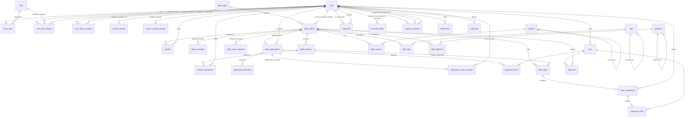

# Modelo de datos — v1

> **La fuente de verdad del schema es la skill `arquitectura` §4** (`.claude/skills/arquitectura/`) desde F4.0, y dentro de ella desde #274: convenciones (§4.1), el DDL baseline y las migraciones posteriores (§4.4, §4.6), las reglas de negocio que reemplazaron a los triggers (§4.5), lo que queda fuera de v1 (§4.7) y la línea entre `Admin` y `Owner`. Los números son los que tenían acá con el prefijo `4.`.
>
> Este documento conserva lo que se lee para entender el modelo y no se aplica al escribirlo: qué cambió respecto del schema heredado (§2) y el diagrama entidad-relación (§3), que se actualiza en el mismo cambio que la `@Entity` (skill `arquitectura` §7.3).
>
> El **porqué** de cada cosa está en `decisiones.md`. **Alcance v1**: el schema heredado consolidado, corregido y ampliado. **Campañas y Temporadas quedan fuera a propósito** (`decisiones.md` #7), igual que la integración profunda con Discord.

## 2. Qué cambió respecto al schema heredado

El detalle y el razonamiento están en `decisiones.md`. Resumen de lo estructural:

| Área | Cambio | Ref. |
|---|---|---|
| Nombres | `Tables` → `game_tables`, `Users_registration` → `table_registrations`, `Users_Rejected` → `registration_rejections`, `Days` → `table_schedules`, `Logs` → `audit_logs` | — |
| Zona horaria | **Se eliminan** `users.timezone` y `game_tables.timezone` | #22 |
| Roles | Son **cuatro**: `Player`, `Master`, `Admin`, `Owner`. Acumulables, sin jerarquía | #37, #67 |
| Rol de mesa | `masters.master_type` pasa de `Owner`/`Master` a **`Primary`/`Secondary`** | #71 |
| Postulaciones | **Se quita** el `UNIQUE (game_table_id, user_id)`: un usuario puede postularse N veces | #23 |
| Contador de jugadores | Se elimina `Players_Table`; se deriva con `COUNT`. Se agrega `max_players` | #11, #24 |
| Sesiones | Tabla nueva `table_sessions`, materializada, con asistencia | #33, #36 |
| Peticiones | Tablas nuevas `table_tasks` + `task_submissions` + `submission_files` | #63 |
| Comentarios | **Se elimina `comments.user_created_id`**. El autor vive solo en `comment_drafts` y desaparece al confirmar. Cuota antispam como token opaco | #43, #49, #82 |
| Catálogos | `parent_id` → **`canonical_id`**, profundidad 1. Son grupos de sinónimos, no jerarquía | #53, #59 |
| Archivos | `file_type` (`Public`/`Private`/`Single-use`) y `size_bytes`, que el código usaba y el DDL nunca tuvo. Más `content_hash`, `storage_key` y `last_used_at` | #60, #68, #75, #80 |
| Aprobaciones | `requests` se absorbe en **`approval_requests`**, un solo mecanismo para todos los pedidos con aprobación. **La tabla ya estaba en `V1__baseline.sql`**: F3.2 le puso el código, no el DDL, así que no hay migración propia y no puede haberla (regla dura 8). Nace con **tres** tipos —`MasterGrant`, `TableOpen`, `General`—, no con los cinco que enumera #90: `TablePause` y `PlayerBan` los agrega F3.4 **con su productor**, porque la columna es `VARCHAR(32)` y sumar un flujo es sumar un valor al enum, sin `ALTER TABLE` (#78). Declararlos antes solo crearía dos valores que nada emite, que es el huérfano que F1.7 le reprochó a `PauseRequested` | #42, #78, #90 |
| Moderación de mesa | Tabla nueva `table_status_changes` con la justificación de cada transición | #32 |
| Moderación de personas | Tablas nuevas `user_role_changes` y `user_status_changes` (`V11`, F3.1), calcadas de `table_status_changes`, con **motivo obligatorio**. `audit_logs` es F6 y `approval_requests` es F3.2: hasta entonces cada entidad guarda su propio rastro en vez de inventar una tabla genérica que F6 va a reemplazar | #84, #169 |
| Configuración | `system_settings` **ya estaba en `V1__baseline.sql`** y no tenía código: F3.5 le puso el mapeo, no el DDL. **Guarda solo overrides** —no hay fila para un ajuste que nadie tocó y no hay seed—, y el catálogo con los valores por defecto, los rangos y la marca de retroactivo vive en el `enum` `SettingKey` (#263). Tabla nueva `system_setting_changes` (`V13`, F3.5), del mismo molde que las de abajo: `setting_key` **sin FK**, porque apunta a una constante del código y porque la fila que nombra puede legítimamente no existir todavía | #141, #263 |
| Moderación de mesa, por persona | Tabla nueva `registration_status_changes` (`V12`, F3.4), del mismo molde: el **veto y su levantamiento**, con motivo obligatorio. Lo que se guarda es el cambio y no el estado — una columna `blocked_reason` no puede contar que se levantó, ni cuántas veces | #29, #39 |
| Feedback del sistema | Tablas nuevas `system_feedback` y `feedback_quotas`. El tipo `General` sale de `comments` | #91, #93, #94 |
| Bandeja de admins | `claimed_by` / `claimed_at` en `approval_requests`, `comments`, `system_feedback` y `game_tables` | #100 |
| PK y tipos rotos | Se corrigen los PK inválidos de `Platforms`/`Tags`/`Systems`, se agregan PK a `registration_rejections` y `audit_logs`, y `Files.mine` pasa a `mime_type VARCHAR(128)` | — |

## 3. Diagrama entidad-relación

Vista general, sin columnas — están en el DDL de la skill `arquitectura` (§4.4).

Para verlo por subsistema y con columnas: `diagramas/11` a `16`. Los ciclos de vida (mesa, postulación, comentario) están en `diagramas/05`, `06` y `07`.

```mermaid
erDiagram
    users ||--o{ users_roles : "tiene"
    roles ||--o{ users_roles : "asignado a"
    users ||--o{ user_role_changes : "historial de roles"
    roles ||--o{ user_role_changes : "otorgado o quitado"
    users ||--o{ user_role_changes : "otorga o quita"
    users ||--o{ user_status_changes : "historial de cuenta"
    users ||--o{ user_status_changes : "bloquea o desbloquea"
    users ||--o{ system_settings : "configuró por última vez"
    users ||--o{ system_setting_changes : "cambió un ajuste"

    table_types  ||--o{ game_tables : "clasifica"
    game_tables  ||--o{ masters : "dirigida por"
    users        ||--o{ masters : "dirige"
    game_tables  ||--o{ table_schedules : "agenda semanal"
    game_tables  ||--o{ table_sessions : "sesiones"
    table_sessions ||--o{ session_attendance : "asistencia"
    users        ||--o{ session_attendance : "asiste"
    game_tables  ||--o{ table_status_changes : "historial de estado"
    users        ||--o{ game_tables : "reserva la revisión (#100)"

    game_tables        ||--o{ table_registrations : "postulaciones"
    users              ||--o{ table_registrations : "se postula"
    table_registrations ||--o{ registration_rejections : "rechazos"
    table_registrations ||--o{ registration_status_changes : "historial de veto (#39)"
    users              ||--o{ registration_status_changes : "veta o levanta"
    table_registrations ||--o{ registration_files : "adjuntos"

    game_tables        ||--o{ table_tasks : "pide"
    table_sessions     ||--o{ table_tasks : "atada a (opcional)"
    table_tasks ||--o{ task_submissions : "entregas"
    users              ||--o{ task_submissions : "entrega"
    task_submissions ||--o{ submission_files : "adjunta"

    users ||--o{ files : "subio"
    files ||--o{ table_files : ""
    files ||--o{ registration_files : ""
    files ||--o{ submission_files : ""
    game_tables ||--o{ table_files : "adjunta"

    game_tables ||--o{ table_systems : "usa"
    systems     ||--o{ table_systems : ""
    systems     ||--o{ systems : "canonico de"
    game_tables ||--o{ table_tags : "etiquetada"
    tags        ||--o{ table_tags : ""
    tags        ||--o{ tags : "canonico de"
    game_tables ||--o{ table_platforms : "se juega en"
    platforms   ||--o{ table_platforms : ""
    platforms   ||--o{ platforms : "canonico de"

    users ||--o{ comments : "es comentado"
    users ||--o{ comments : "modera"
    users ||--o{ comment_drafts : "escribe (solo mientras es borrador)"
    users ||--o{ approval_requests : "solicita"
    users ||--o{ approval_requests : "reserva (#100)"
    users ||--o{ approval_requests : "resuelve"
    users ||--o{ notifications : "recibe"
    users ||--o{ audit_logs : "genera"
    %% system_feedback y comment_quotas no tienen relaciones: son anonimos a proposito
```

`comment_quotas`, `feedback_quotas` y `system_feedback` no aparecen: no tienen relación con ninguna tabla, a propósito — son las piezas anónimas del modelo (#82, #93, #94).

## 1, 4, 5, 6 y 7 — en la skill `arquitectura` §4

| § | Qué es | Dónde |
|---|---|---|
| 4.1 | Convenciones | `SKILL.md` |
| 4.4 y 4.6 | DDL de `V1__baseline.sql`, tabla de migraciones posteriores y seed | `references/modelo-datos/ddl.md` |
| 4.5 | Reglas de negocio por subsistema | `references/modelo-datos/reglas-negocio.md` |
| 4.7 | Fuera de alcance de v1, y §4.7.1 Campañas y Temporadas | `references/modelo-datos/fuera-de-v1.md` |
